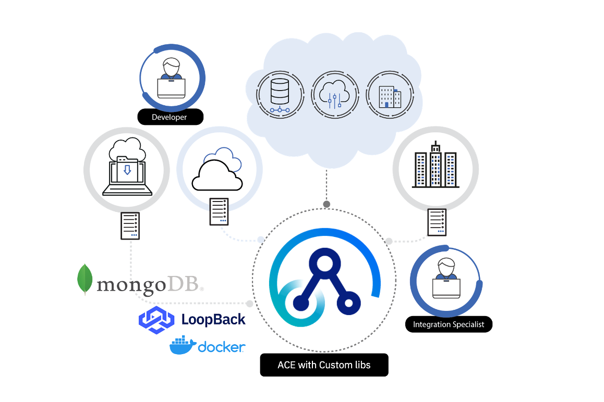

App Connect Enterprise provides a lightweight integration runtime to support the enterprise's journey towards cloud-native development and adopting the containerization environment. In the following, we will build a custom ACE image based on [Red Hat Universal Base Images (UBI)](https://developers.redhat.com/products/rhel/ubi/), along with additional [LoopBack](https://loopback.io/) libraries in order to ensrich integration flows. 


* Download [App Connect developer edition](https://developer.ibm.com/integration/docs/app-connect-enterprise/get-started/) (_Linux flavor_)


* Clone the project 

```bash
git clone https://github.com/ot4i/ace-docker.git
```

* Move/Copy the App Connect file inside the cloned project (`deps` folder)

```bash
mv ~/ace-developer-11008.tar.gz ~/ace-docker/deps 
```
 
 Notice that I am using the `ace-developer-11008.tar.gz` in the Dockerfile. If you wish to change it, then make sure you update the Dockerfile accordingly. 


* Inspect the following `Dockerfile`, and notice how [loopback-connector-mongodb](https://www.npmjs.com/package/loopback-connector-mongodb) was added

```docker
WORKDIR /var/mqsi/
RUN . /opt/ibm/ace-11/server/bin/mqsiprofile && \
    npm install loopback-connector-mongodb --save
```

> Notice that after `USER aceuser` is set, the file starts installing the custom libraries


```docker
FROM golang:1.10.3 as builder

WORKDIR /go/src/github.com/ot4i/ace-docker/
ARG IMAGE_REVISION="Not specified"
ARG IMAGE_SOURCE="Not specified"
COPY cmd/ ./cmd
COPY internal/ ./internal
COPY vendor/ ./vendor
RUN go build -ldflags "-X \"main.ImageCreated=$(date --iso-8601=seconds)\" -X \"main.ImageRevision=$IMAGE_REVISION\" -X \"main.ImageSource=$IMAGE_SOURCE\"" ./cmd/runaceserver/
RUN go build ./cmd/chkaceready/
RUN go build ./cmd/chkacehealthy/
# Run all unit tests
RUN go test -v ./cmd/runaceserver/
RUN go test -v ./internal/...
RUN go vet ./cmd/... ./internal/...

ARG ACE_INSTALL=ace-developer-11008.tar.gz
WORKDIR /opt/ibm
COPY deps/$ACE_INSTALL .
RUN mkdir ace-11
RUN tar -xzf $ACE_INSTALL --absolute-names --exclude ace-11.\*/tools --strip-components 1 --directory /opt/ibm/ace-11

FROM registry.access.redhat.com/ubi7/ubi-minimal

ENV SUMMARY="Integration Server for App Connect Enterprise" \
    DESCRIPTION="Integration Server for App Connect Enterprise" \
    PRODNAME="AppConnectEnterprise" \
    COMPNAME="IntegrationServer"

LABEL summary="$SUMMARY" \
      description="$DESCRIPTION" \
      io.k8s.description="$DESCRIPTION" \
      io.k8s.display-name="Integration Server for App Connect Enterprise" \
      io.openshift.tags="$PRODNAME,$COMPNAME" \
      com.redhat.component="$PRODNAME-$COMPNAME" \
      name="$PRODNAME/$COMPNAME" \
      vendor="IBM" \
      version="11.0.0.6" \
      release="1" \
      license="IBM" \
      maintainer="Hybrid Integration Platform Cloud" \
      io.openshift.expose-services="" \
      usage=""

# Add required license as text file in Liceses directory (GPL, MIT, APACHE, Partner End User Agreement, etc)
COPY /licenses/ /licenses/

# Create OpenTracing directories, and copy in any library or configuration files available
RUN mkdir /etc/ACEOpenTracing /opt/ACEOpenTracing /var/log/ACEOpenTracing
COPY deps/OpenTracing/library/* ./opt/ACEOpenTracing/
COPY deps/OpenTracing/config/* ./etc/ACEOpenTracing/

WORKDIR /opt/ibm

RUN microdnf install --nodocs openssl util-linux unzip python2 && \
    microdnf clean all

COPY --from=builder /opt/ibm/ace-11 /opt/ibm/ace-11
RUN /opt/ibm/ace-11/ace make registry global accept license silently

# Copy in PID1 process
COPY --from=builder /go/src/github.com/ot4i/ace-docker/runaceserver /usr/local/bin/
COPY --from=builder /go/src/github.com/ot4i/ace-docker/chkace* /usr/local/bin/

# Copy in script files
COPY *.sh /usr/local/bin/

ADD https://storage.googleapis.com/kubernetes-release/release/v1.16.0/bin/linux/amd64/kubectl /usr/local/bin/kubectl
RUN chmod +x /usr/local/bin/kubectl && \
    /usr/local/bin/kubectl version --client

# Create a user to run as, create the ace workdir, and chmod script files
RUN useradd -u 1000 -d /home/aceuser -G mqbrkrs,wheel aceuser \
  && su - aceuser -c '. /opt/ibm/ace-11/server/bin/mqsiprofile && mqsicreateworkdir /home/aceuser/ace-server' \
  && chmod 755 /usr/local/bin/*

# Set permissions for OpenTracing directories
RUN chown aceuser:aceuser /etc/ACEOpenTracing /opt/ACEOpenTracing /var/log/ACEOpenTracing

# Set BASH_ENV to source mqsiprofile when using docker exec bash -c
ENV BASH_ENV=/usr/local/bin/ace_env.sh

# Expose ports.  7600, 7800, 7843 for ACE; 9483 for ACE metrics
EXPOSE 7600 7800 7843 9483

USER aceuser

WORKDIR /home/aceuser
RUN mkdir /home/aceuser/initial-config && \
    chown aceuser:aceuser /home/aceuser/initial-config

WORKDIR /var/mqsi/
RUN . /opt/ibm/ace-11/server/bin/mqsiprofile && \
    npm install loopback-connector-mongodb --save

WORKDIR /home/aceuser/ace-server/config/connectors/loopback
RUN touch datasources.json
     
ENV LOG_FORMAT=basic

# Set entrypoint to run management script
ENTRYPOINT ["runaceserver"]
```

* Navigate to `ace-docker` folder and build the custom ACE integration server

```bash
cd ~/ace-docker
docker build -t ace-only:v1 --build-arg ACE_INSTALL=ace-developer-11008.tar.gz --file ubi/Dockerfile.aceonly .
```

