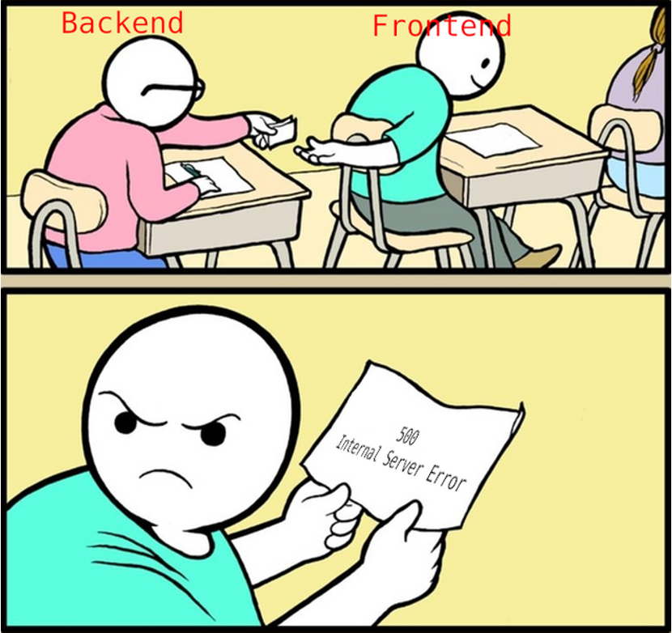

I had a discussion a few weeks ago with a client who wanted to mask error code and messages to avoid exposing internal information about backend services, such as the type of the error or service version.

Besides authentication and authorization, developers must consider protecting from common attacks such as injection or cross-site scripting with security measures that can safeguard backend services, mitigate these vulnerabilities, and reduce the risk of successful attacks. 

One of those measures is to protect internal information from getting exposed. To overcome that, API Connect provides a set of runtime policies that can help API developers control data flow. In today's blog, I will talk about the [Throw policy](https://www.ibm.com/docs/en/api-connect/10.0.5.x_lts?topic=constructs-throw).


## The Throw Policy

The policy throws an error usually as a result of a condition being reached. It takes three keys properties:

 * **error-status-code**: it referenaces to `message.status.code` API context variable.
 * **error-status-reason**: it referances to reference the `message.status.reason` API context variable.
 * **message**: The message to accompany the error.

You can use the policy in any stage in the API flow, for example if the authentication service returns `status-code: 500`

```yaml
    execute:
      - switch:
          version: 2.0.0
          title: switch
          case:
            - condition: ($statusCode() = 500)
              execute:
                - throw:
                    version: 2.1.0
                    title: throw
                    name: 500-err
                    error-status-code: '500'
                    message: The service is not available. Please try again later
```

Worth to mention, you can combine it with catch policy to organize the error handling logic in the API flow.

## The Catch Policy

The policy catchs errors that occur during an API call, and allows you to conctruct a error hanlding flow. It takes an array of objects of `errors` and `execute`.

* **errors**: for which the `catch` will activate.
* **execute**: what will execute when the catch is activated.

Also, you have the `default` option that will execute when an error does not trigger other catches; _think about like `default` logic in [switch statement](https://www.geeksforgeeks.org/switch-statement-in-cpp/) in object oriented programming_.

The policy supports large set of Error cases such as: **TransformError**, **BadRequestError**, and **RuntimeError**. For more read about: [Error cases supported by assembly catches
](https://www.ibm.com/docs/en/api-connect/10.0.5.x_lts?topic=reference-error-cases-supported-by-assembly-catches).


Here's an example of combining both `Throw` and `Catch` policies.

```yaml
    catch:
      - errors:
          - AssemblyRateLimitError
        execute:
            - throw:
                version: 2.1.0
                title: throw
                name: exceed-limit
                error-status-code: '429'
                message: Upgrade the API subscription plan, or Try again later.
      - default:
            - activity-log:
                title: activity-log
                content: activity
                error-content: payload
```