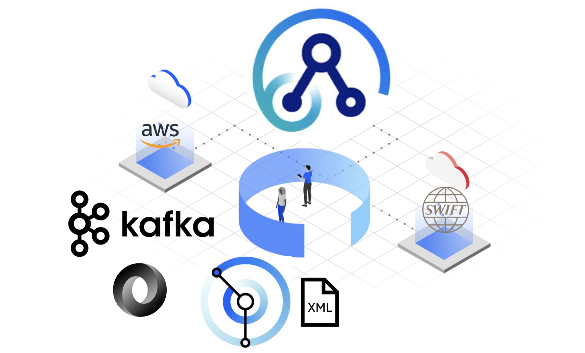
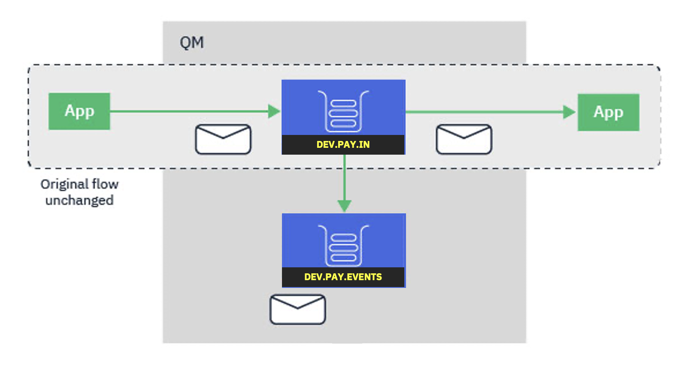
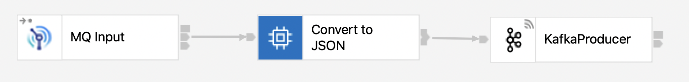
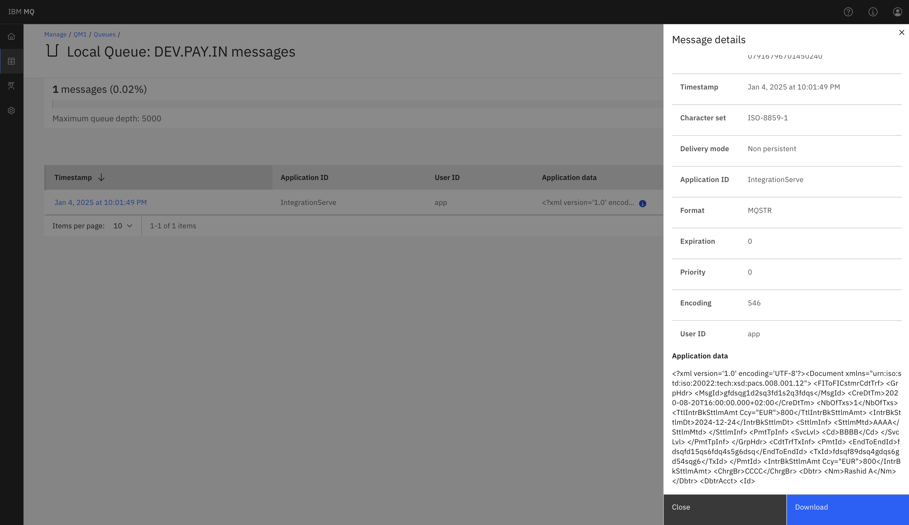
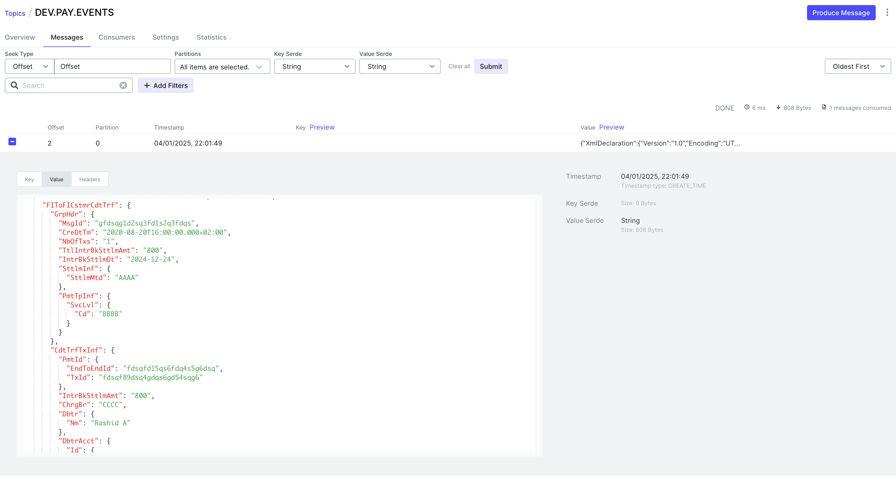

Enterprises offer a multitude of channels for users to interact with. The channels include traditional methods like ATMs and modern methods like digital wallets. Enterprises can unlock a wealth of benefits by capitalizing on business events in real-time .. naming a few:

1. Enhanced Analytics Capabilities
2. Improved Business Visibility
3. Better Security

By centralizing and analyzing business events from various sources, enterprises can gain a comprehensive understanding of their bussiness applications, enabling them to make more informed decisions and take proactive actions; in other words, to become an [event-driven enterprise](https://www.gartner.com/en/documents/3942102). However, events are diverse in nature, and that is expected due to the various industrial strandards and practices.

In this blog, I will explore how [IBM App Connect](https://www.ibm.com/products/app-connect) can address this challenge.

IBM App Connect has been transforming and streamlining transactions for businesses worldwide. It offers a wide range of features and capabilities designed to help enterprises automate and optimize their integration requirements, ensuring seamless and efficient communication between various systems and applications. Also, it has built-in support for messages in the multiple domains such as `BLOB`, `XML`, `JSON`, and `DFDL`, and wide range of [industrial standards](https://www.ibm.com/docs/en/app-connect/13.0?topic=information-industry-standard-formats) and [messaging protocols](https://www.ibm.com/docs/en/app-connect/13.0?topic=development-built-in-nodes), such as `FIN`, `SWIFT`, `EDIFACT` and `X12`.

Let me demonstrate this by guiding you through an example that will accomplish the following tasks:

1. Receive messages from [IBM MQ](https://www.ibm.com/products/mq)
2. Transform messages
3. Stream messages to a [Kafka cluster](https://www.ibm.com/products/event-streams)

## Queuing System Configuration

The [streaming queues](https://www.ibm.com/docs/en/ibm-mq/9.4?topic=scenarios-streaming-queues) feature of IBM MQ allows you to configure a queue to put a near-identical copy of every message to a second queue. The feature is useful when you need to create a copy of your messages without impacting ongoing communications.

I have created two local queues, `DEV.PAY.IN` and `DEV.PAY.EVENTS`. 



Messages will be queued in `DEV.PAY.IN`, simultaneously, a copy of every message will be stored in `DEV.PAY.EVENTS`.

```
DEFINE QLOCAL(DEV.PAY.EVENTS)
DEFINE QLOCAL(DEV.PAY.IN) STRMQOS(MUSTDUP) STREAMQ(DEV.PAY.EVENTS)
```

You can configure streaming queues in one of two modes: **Best effort** and **Must duplicate**. For more information, see [how you configure streaming queues](https://www.ibm.com/docs/en/SSFKSJ_9.4.0/configure/msgduphowconfig.html) for information on the additional attributes added to local and model queues enabling message streaming.


## Develop the Integration Flow

In this section, I will use App Connect to address the following 3 items:

1. Receive messages from [IBM MQ](https://www.ibm.com/products/mq)
2. Transform messages
3. Stream messages to a [Kafka cluster](https://www.ibm.com/products/)

App Connect supplies built-in nodes that you can use to define your message flows, in the case, reading messages from MQ.



The [MQInput](https://www.ibm.com/docs/en/app-connect/13.0?topic=nodes-mqinput-node) node receives messages from a specified queue through a local or client connection to a queue manager. As mentioned earlier, I will be using the `DEV.PAY.EVENTS` queue. 

Let's explore the type of messages in this queue. The `DEV.PAY.IN` queue stores [pacs.008 ISO 20022](https://www.iso20022.org/iso-20022-message-definitions?search=Payments%20Clearing%20and%20Settlement) messages. The `pacs.008` format is used when banks exchange payments with other banks for [payments clearing and settlement](https://www2.swift.com/knowledgecentre/rest/v1/publications/stdsmx_pcs_mdrs/4.0/SR2021_MX_PaymentsClearingAndSettlement_MDR1_Standards.pdf) scenarios.




Before streaming SWIFT messages to a Kafka cluster, the messages need to be converted to a more friendly structure. App Connect provides multiple options to develop the transformation logic, such as [Graphical Mapping](https://www.ibm.com/docs/en/SSTTDS_13.0/com.ibm.etools.mft.doc/bc28600_.html) node, [ResetContentDescriptor](https://www.ibm.com/docs/en/app-connect/13.0?topic=nodes-resetcontentdescriptor-node) node, [Java Compute](https://www.ibm.com/docs/en/SSTTDS_13.0/com.ibm.etools.mft.doc/ac20805_.html) node, and [ESQL Compute](https://www.ibm.com/docs/en/SSTTDS_13.0/com.ibm.etools.mft.doc/ac04660_.html) node.

Extended Structured Query Language (ESQL) is a programming language available in App Connect to define and manipulate data within a message flow. ESQL is based on Structured Query Language (SQL) which is in common usage with relational database.

This ESQL code snippet converts an XML message into JSON format:

```sql
SET OutputRoot.Properties = InputRoot.Properties;
CREATE LASTCHILD OF OutputRoot DOMAIN('JSON');
CREATE FIELD OutputRoot.JSON.Data;
SET OutputRoot.JSON.Data = InputRoot.XMLNSC;
```

Let me explain the logic a little more:

1. The first line, `SET OutputRoot.Properties = InputRoot.Properties;`, sets the properties of the `OutputRoot` object to the same values as those of the `InputRoot` object. This is used to copy the state of one object to another
2. The second line, `CREATE LASTCHILD OF OutputRoot DOMAIN('JSON');`, creates a new child node called `JSON` under the `OutputRoot` object, and specifies that its data type should be of the `DOMAIN('JSON')` type. This allows me to work with the `JSON` data type in the following lines of code.
3. The third line, `CREATE FIELD OutputRoot.JSON.Data;`, creates a new field called `Data` within the `JSON` child node. This field will hold the actual JSON data.
4. The fourth line, `SET OutputRoot.JSON.Data = InputRoot.XMLNSC;`, assigns the `XMLNSC` value of the `InputRoot` object to the `Data` field of the `JSON` child node. This converts the XML data from the `InputRoot` object into JSON format.




Now, the messages are converted to the desired structure, I can simply publish them to a Kafka cluster.

You can use the  [KafkaProducer](https://www.ibm.com/docs/en/app-connect/13.0?topic=nodes-kafkaproducer-node) node to connect to the Apache Kafka messaging system, and to publish messages from a message flow to a topic, i.e. `DEV.PAY.EVENTS`.