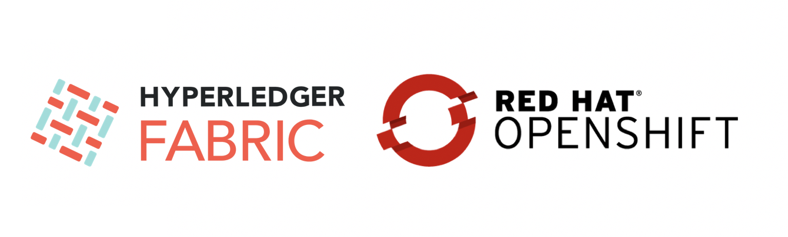

The following script was written based on the instructions that are provided [here](https://cloud.ibm.com/docs/services/blockchain-rhos?topic=blockchain-rhos-deploy-ocp). It takes roughly `5 minutes` to complete the deployment - makes sure persistent storage is available in your cluster because the platform uses dynamic provisioning to allocate storage for each blockchain node that you deploy by using a pre-defined storage class; [OpenShift persistent storage options](https://docs.openshift.com/container-platform/3.11/architecture/additional_concepts/storage.html)


```bash
#!/bin/bash

read -p 'Namespace name: ' ns

# create OpenShift project
echo -n "Create a new namespace: $ns .. "
oc new-project $ns > /dev/null
oc project $ns > /dev/null

echo "Done"
# create add security and access policies
echo -n "Add security and access policies .. "

project_name="my-blockchain"

oc create -f ibp-scc.yaml -n $ns > /dev/null
oc adm policy add-scc-to-user $project_name system:serviceaccounts:$ns > /dev/null
oc create -f ibp-clusterrole.yaml -n $ns > /dev/null

oc adm policy add-scc-to-group $project_name system:serviceaccounts:$ns > /dev/null
oc create -f ibp-clusterrolebinding.yaml -n $ns > /dev/null
oc adm policy add-cluster-role-to-user $project_name system:serviceaccounts:$ns > /dev/null

echo "Done"

# create docker-registry secret
echo  "Kindly, pass your images registry details:"
read -s -p "Docker Server: `echo $'\n>'`" server
read -s -p "Docker Username: `echo $'\n>'`" username
read -s -p "Docker Password: `echo $'\n>'`" password

echo -n "`echo $'\n>'`Create Docker Registry secret .. "
oc create secret docker-registry docker-key-secret --docker-server=$server --docker-username=$username --docker-password=$password -n $ns > /dev/null
echo "Done"

# create ibp operator and ibp console
echo -n "Create IBM Blockchain Platform Operator .. "
oc create -f ibp-operator.yaml -n $ns > /dev/null
sleep 30
echo "Done"

echo -n "Create IBM Blockchain Platform Console .. "
oc create -f ibp-console.yaml  -n $ns > /dev/null
sleep 30
echo "Done"

echo "Deployment is completed"
echo -n "Console URL: "
echo -n oc get route -n $ns | grep -E "^ibpconsole-console\ " | awk '{print $2}'
echo "Username: admin"
echo "Password: admin"
```
