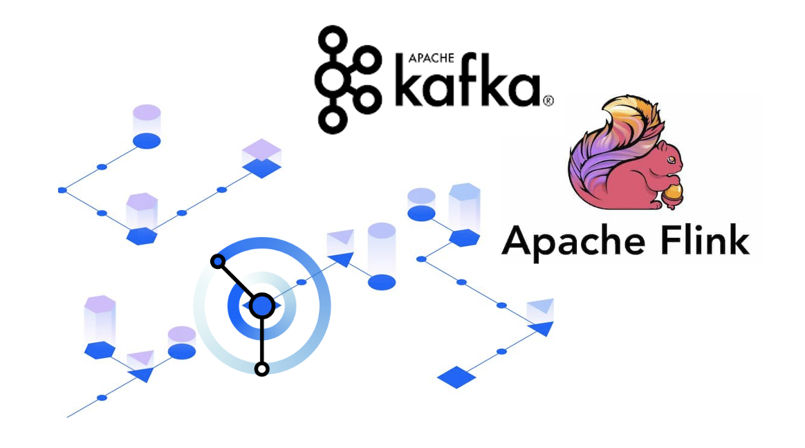
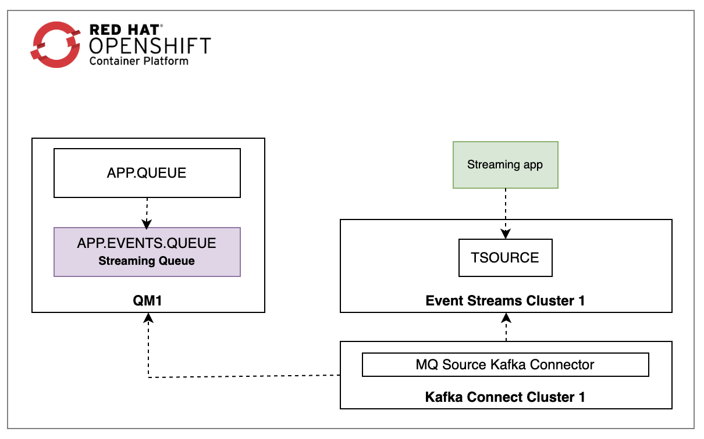

The objective of this post is to showcase how to:

1. Source a queue of messages to a Kafka Cluster.
2. Build a streaming application to act in real time.

## Technology used:

* IBM MQ
* IBM Event Streams
* Apache Flink
* OpenShift Container Platform


## High level solution diagram 




Messages arrive to `APP.QUEUE` queue via `MVP.APP.SVRCONN` channel. A [streaming queue](https://www.ibm.com/docs/en/ibm-mq/9.3?topic=scenarios-streaming-queues) `APP.EVENTS.QUEUE` gets a copy of every message in the `APP.QUEUE` queue.

Example of `APP.QUEUE` messages:

```xml
<transaction>102</transaction>
<action>payment</action>
<account>checking</account>
<status>failed</status>
```

Kafka Connect defines a [MQ Kafka Connector](https://community.ibm.com/community/user/ai-datascience/viewdocument/kafka-connectors-for-ibm-mq-a-mq?CommunityKey=b382f2ab-42f1-4932-aa8b-8786ca722d55) to source out messages from the streaming queue, `APP.EVENTS.QUEUE`, to a Kafka topic `TSOURCE`. Then, An [Apache Flink](https://flink.apache.org/what-is-flink/flink-architecture/) job listens to `TSOURCE` messages, and perform two actions:

1. Pick up `failed` events.
2. Transform events stracture from `xml` to `json`.


Example of the Flink job output:

```json
{
  "transaction": 101,
  "action": "payment",
  "account": "checking",
  "status": "failed"
}
```


## Deployment Steps

### MQ

* Define a configmap with MQ mqsc configurations:

```yaml
cat << EOF | oc apply -f -
  kind: ConfigMap
  apiVersion: v1
  metadata:
    name: mqsc-setting
  data:
    mq.mqsc: >
      DEFINE CHANNEL(MVP.APP.SVRCONN) CHLTYPE(SVRCONN)
      SET CHLAUTH(MVP.APP.SVRCONN) TYPE(BLOCKUSER) USERLIST('nobody')
      SET CHLAUTH('*') TYPE(ADDRESSMAP) ADDRESS('*') USERSRC(NOACCESS)
      SET CHLAUTH(MVP.APP.SVRCONN) TYPE(ADDRESSMAP) ADDRESS('*') USERSRC(CHANNEL) CHCKCLNT(REQUIRED)
      ALTER AUTHINFO(SYSTEM.DEFAULT.AUTHINFO.IDPWOS) AUTHTYPE(IDPWOS) ADOPTCTX(YES)
      REFRESH SECURITY TYPE(CONNAUTH)
      DEFINE QLOCAL(APP.EVENTS.QUEUE) MAXDEPTH(100) REPLACE
      DEFINE QLOCAL(APP.QUEUE) STRMQOS(MUSTDUP) STREAMQ(APP.EVENTS.QUEUE) MAXDEPTH(100) REPLACE
      SET AUTHREC OBJTYPE(QMGR) PRINCIPAL('1001') AUTHADD(CONNECT,INQ)
      SET AUTHREC PROFILE(APP.EVENTS.QUEUE) OBJTYPE(QUEUE) PRINCIPAL('1001') AUTHADD(ALLMQI)
EOF
```

* Build a QueueManager custom resource instance:

```yaml
cat << EOF | oc apply -f -
  apiVersion: mq.ibm.com/v1beta1
  kind: QueueManager
  metadata:
    name: qm1
  spec:
    license:
      accept: true
      license: L-RJON-CJR2RX
      use: NonProduction
    queueManager:
      debug: true
      mqsc:
        - configMap:
            items:
              - mq.mqsc
            name: mqsc-setting
      name: QM1
      resources:
        limits:
          cpu: 500m
        requests:
          cpu: 500m
      storage:
        queueManager:
          type: ephemeral
    template:
      pod:
        containers:
          - env:
              - name: MQSNOAUT
                value: 'yes'
            name: qmgr
    version: 9.3.2.0-r1
    web:
      enabled: true
EOF
```


### Event Streams

```yaml
cat << EOF | oc apply -f -
  apiVersion: eventstreams.ibm.com/v1beta2
  kind: EventStreams
  metadata:
    name: es-development
  spec:
    license:
      accept: true
      use: CloudPakForIntegrationNonProduction
    requestIbmServices:
      iam: true
      monitoring: true
    strimziOverrides:
      kafka:
        authorization:
          authorizerClass: com.ibm.eventstreams.runas.authorizer.RunAsAuthorizer
          supportsAdminApi: true
          type: custom
        config:
          default.replication.factor: 3
          inter.broker.protocol.version: '3.4'
          log.cleaner.threads: 6
          min.insync.replicas: 2
          num.io.threads: 24
          num.network.threads: 9
          num.replica.fetchers: 3
          offsets.topic.replication.factor: 3
        listeners:
          - authentication:
              type: scram-sha-512
            name: external
            port: 9094
            tls: true
            type: route
          - authentication:
              type: tls
            name: tls
            port: 9093
            tls: true
            type: internal
        metricsConfig:
          type: jmxPrometheusExporter
          valueFrom:
            configMapKeyRef:
              key: kafka-metrics-config.yaml
              name: development-metrics-config
        replicas: 3
        storage:
          type: ephemeral
      zookeeper:
        metricsConfig:
          type: jmxPrometheusExporter
          valueFrom:
            configMapKeyRef:
              key: zookeeper-metrics-config.yaml
              name: development-metrics-config
        replicas: 3
        storage:
          type: ephemeral
    adminUI: {}
    restProducer: {}
    apicurioRegistry: {}
    adminApi: {}
    collector: {}
    version: latest
EOF
```

### KafkaConnect

```yaml
cat << EOF | oc apply -f -
  apiVersion: eventstreams.ibm.com/v1beta2
  kind: KafkaConnect
  metadata:
    name: my-connect-cluster
  spec:
    authentication:
      certificateAndKey:
        certificate: user.crt
        key: user.key
        secretName: kafka-user
      type: tls
    bootstrapServers: 'bootstrapServers:port'
    config:
      config.storage.replication.factor: 3
      config.storage.topic: connect-cluster-configs
      group.id: connect-cluster
      offset.storage.replication.factor: 3
      offset.storage.topic: connect-cluster-offsets
      status.storage.replication.factor: 3
      status.storage.topic: connect-cluster-status
    image: 'kafka-connect-image:tag'
    replicas: 1
    template:
      pod:
        imagePullSecrets: []
        metadata:
          annotations:
            cloudpakId: <cloudpakId>
            productVersion: 11.1.5
            productID: <productID>
            cloudpakName: IBM Cloud Pak for Integration
            productChargedContainers: my-connect-cluster-connect
            productCloudpakRatio: '2:1'
            productName: IBM Event Streams for Non Production
            eventstreams.production.type: CloudPakForIntegrationNonProduction
            productMetric: VIRTUAL_PROCESSOR_CORE
    tls:
      trustedCertificates:
        - certificate: ca.crt
          secretName: es-development-cluster-ca-cert
EOF
```

Note: 
* Make sure you update the following values `spec.bootstrapServers`, `spec.tls`, and `spec.authentication`.
* Make sure you [create your own container image](https://ibm.github.io/event-streams/connecting/setting-up-connectors/#adding-connectors-to-your-kafka-connect-environment): `spec.image`.


### MQ Source Kafka Connector

```yaml
cat << EOF | oc apply -f -
  apiVersion: eventstreams.ibm.com/v1beta2
  kind: KafkaConnector
  metadata:
    name: mq-source-connector
    labels:
      eventstreams.ibm.com/cluster: my-connect-cluster
  spec:
    class: com.ibm.eventstreams.connect.mqsource.MQSourceConnector
    config:
      mq.channel.name: MVP.APP.SVRCONN
      mq.record.builder.key.header: JMSMessageID
      value.converter: org.apache.kafka.connect.storage.StringConverter
      mq.user.name: 1001
      mq.queue.manager: QM1
      mq.queue: APP.EVENTS.QUEUE
      mq.record.builder: com.ibm.eventstreams.connect.mqsource.builders.DefaultRecordBuilder
      topic: TSOURCE
      key.converter: org.apache.kafka.connect.storage.StringConverter
      mq.message.body.jms: true
      mq.connection.name.list: qm1-address(1414)
    tasksMax: 1
EOF
```

Note:
* You can use `mq.record.builder.key.header` key to append the event header key with `JMSMessageID`.
* The value can be any of the following keys: `JMSCorrelationID`, `JMSCorrelationIDAsBytes`, and `JMSDestination`.
* `RecordBuilder` is a pluggable component, and you can customize to support additional requirements.


### Apache Flink Job

* Define IBM Event Stream connection using [KafkaSource](https://nightlies.apache.org/flink/flink-docs-master/api/java/org/apache/flink/connector/kafka/source/KafkaSource.html) class:

```java
String bootstrap_route = "<bootstrap_route>:443";
KafkaSource<String> ksource = KafkaSource.<String>builder()
      .setBootstrapServers(brokers)
      .setTopics("TSOURCE")
      .setGroupId("flink-consumer-group")
      .setStartingOffsets(OffsetsInitializer.earliest())
      .setValueOnlyDeserializer(new SimpleStringSchema())
      .setProperty("security.protocol", "SASL_SSL")
      .setProperty("ssl.truststore.location", "<path>/es-cert.p12")
      .setProperty("ssl.truststore.password", "******")
      .setProperty("sasl.mechanism", "SCRAM-SHA-512")
      .setProperty("ssl.protocol", "TLSv1.2")
      .setProperty("sasl.jaas.config", "org.apache.kafka.common.security.scram.ScramLoginModule required username=\"*****\" password=\"*****\";")
  .build();
```

* Define [DataStream](https://nightlies.apache.org/flink/flink-docs-master/docs/dev/datastream/overview/#what-is-a-datastream) object:

```java
DataStream<String> stream = env.fromSource(ksource, WatermarkStrategy.noWatermarks(), "Kafka Source");
```

* Filter events and transform them:

```java
stream = stream.filter(s -> s.contains("failed"))
               .map(s -> new toJson(s).object);
```

* Unpack the `toJson` class:

```java
public toJson(String xml) {
    try {
        JSONObject _json = XML.toJSONObject(xml);
        this.object = _json.toString();
    } catch (JSONException je) {
        System.out.println("Exceptions happen!\"," + je.toString());
    }
}
```

* Print the events using [PrintSink](https://nightlies.apache.org/flink/flink-docs-release-1.17/api/java//org/apache/flink/streaming/api/functions/sink/PrintSink.html) class:

```java
PrintSink<String> sink = new PrintSink<>(true);
stream.sinkTo(sink);
```