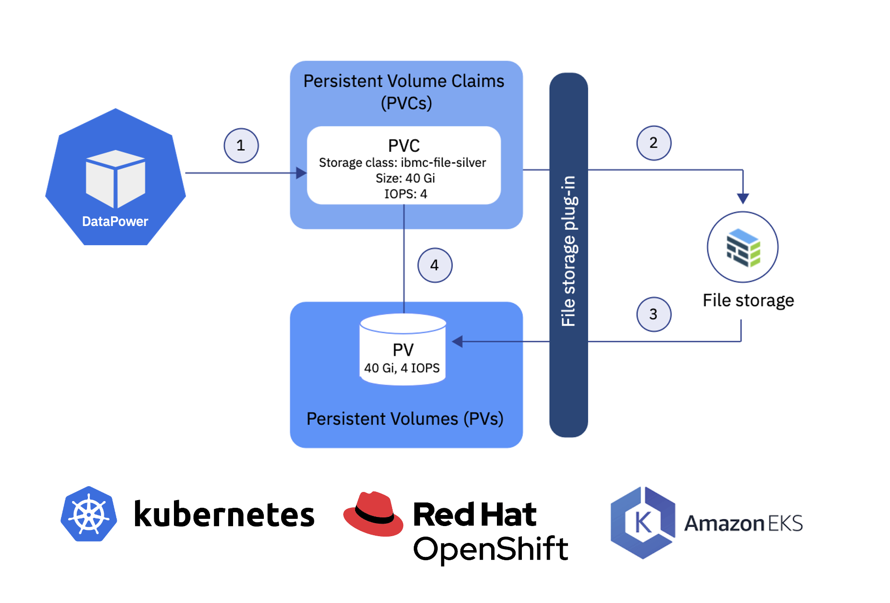

I was asked recently how to maintain DataPower, container-based, configurations that were made via web-mgmt UI. DataPowerService supports the Storage property which provides a list of storage definitions. There are two options: `ephermeral` and `persistent`.

In the persistent mode, the CR creates a `persistent volume claims` to request a `persistent volumes` - a mechanism that keeps data even after the pod is deleted or restarted.

For example:

```yaml
storage:
- type: persistent
  path: /opt/ibm/datapower/drouter/config
  size: 10Gi
  class: some-storage-class
  volumeMode: Filesystem
- type: ephemeral
  path: /opt/ibm/datapower/drouter/temporary
  size: 2Gi
```

> The Persistent Volume (PV) must use an access mode of ReadWriteOnce.


Here is a complete example of DataPowerService instance:

```yaml
apiVersion: datapower.ibm.com/v1beta3
kind: DataPowerService
metadata:
  name: idg-demo
  namespace: cp4i
spec:
  license:
    accept: true
    license: L-RJON-CCCP46
    use: nonproduction
  resources:
    limits:
      memory: 4Gi
    requests:
      cpu: 1
      memory: 4Gi
  users:
    - accessLevel: privileged
      name: admin
      passwordSecret: idg-demo-admin
  domains:
    - dpApp:
        config:
          - dp-webui-config
      name: default
  version: 10.0.4.0sr1
  storage:
    - type: persistent
      path: /opt/ibm/datapower/drouter/config
      size: 5Gi
      class: ibmc-file-bronze-gid
      volumeMode: Filesystem
    - type: persistent
      path: /opt/ibm/datapower/drouter/local
      size: 1Gi
      class: ibmc-file-bronze-gid
      volumeMode: Filesystem
    - type: ephemeral
      path: /opt/ibm/datapower/drouter/temporary
      size: 1Gi
  replicas: 1
  ```