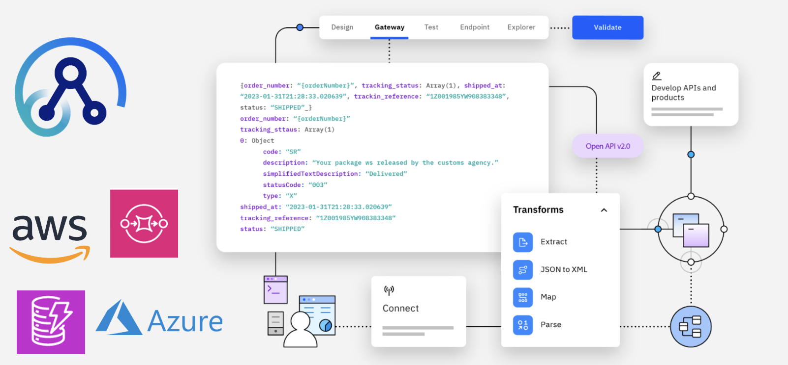
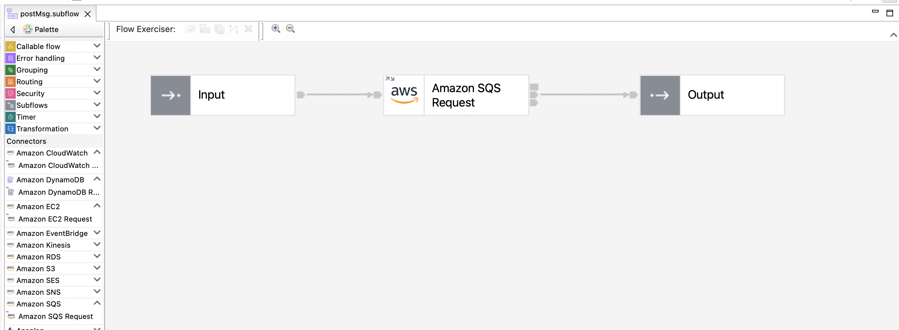
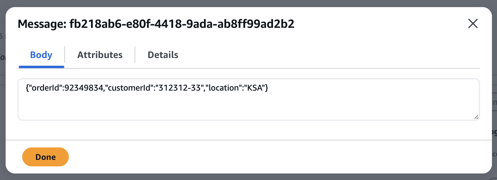

During a recent conversation, my client expressed interest in examining alternatives for integrating their existing systems with Amazon services like Simple Queue Service (SQS) and EventBridge. The primary goal was to discover a flexible solution capable of seamlessly connecting various applications and data sources, not limited to AWS services. 

[IBM App Connect](https://www.ibm.com/products/app-connect) is designed for this reason! It comes packed with numerous pre-built connectors and customizable templates, enabling users to quickly link various cloud, SaaS, and on-premises applications and data sources.

Let me demonstrate this by guiding you through creating a simple integration flow that receives HTTP input and sends it to an AWS SQS queue.

## Steps

* Ceate a work directory to be used by an IBM® App Connect Enterprise integration server.

```bash
mqsicreateworkdir sqsintegration
```

* Configure an IBM App Connect Enterprise vault for storing encrypted credentials, which can be used to access secured resources.

```bash
mqsivault --work-dir sqsintegration --create --vault-key "********" 
```

*  Encrypt credentials and store them in an IBM App Connect Enterprise vault.

```bash
mqsicredentials --work-dir sqsintegration \
--create \
--vault-key "********" \
--credential-type amazonsqs \
--credential-name myPolicy_AmazonSQS \
--secret-access-key "********" \
--access-key-id "********"
```

*  Start an IBM App Connect Enterprise integration server.

```bash
IntegrationServer --name sqsintegration --work-dir sqsintegration --http-port-number 7800 --admin-rest-api 7600 --vault-key ********
```

*  Open the App Connect development toolkit, and start a quick [REST API](https://www.ibm.com/docs/en/app-connect/13.0?topic=apis-creating-rest-api) project. If you do not have it, you can download at: [Download IBM App Connect Enterprise Evaluation Edition and get started with a hands-on experience](https://www.ibm.com/docs/en/app-connect/13.0?topic=gsace-download-app-connect-enterprise-evaluation-edition-get-started).

*  Define the operation and the API's specifications. In this example, I simply, created a `post` operation. The flow uses [Amazon SQS Request Node](https://www.ibm.com/docs/en/app-connect/13.0?topic=nodes-amazon-sqs-request-node) to put a message in the AWS SQS queue.



The payload strcuture is:

```json
{ "orderId": 123456789, "customerId": "123-45", "location": "EMEA"}
```

*  Go to the [Amazon SQS Request Node settings](https://www.ibm.com/docs/en/app-connect/13.0?topic=nodes-amazon-sqs-request-node), and update the following properties:

  1. **Connection**: Create and assign the [Amazon SQS policy](https://www.ibm.com/docs/en/app-connect/13.0?topic=properties-amazon-sqs-policy), which contains the connection details that are used by an Amazon SQS Request node when connecting to an Amazon SQS application.
  2. **Request**: The Map inputs table is used to define the input that is available for use when building the message to be sent to the Amazone SQS connector, and for defining the filter values for operations that require a filter. For example, I added a new input from `$InputRoot/JSON/Data` location.
  3. **Basic**: Click on `Launch Connector Discovery` to select the action to be performed by the Amazon SQS Request node, such as, Put messages and Create Queues.

*  Upload the Policy and REST API to the IntegrationServer.
* Test the integration service:

```bash
curl --request POST \
  --url http://localhost:7800/sqsput/v1/msg \
  --header 'accept: application/json' \
  --header 'content-type: application/json' \
  --data '{
  "orderId": 92349834,
  "customerId": "312312-33",
  "location": "KSA"
}'
```
*  Here is the final result landed successfully to the Amazon SQS queue:



