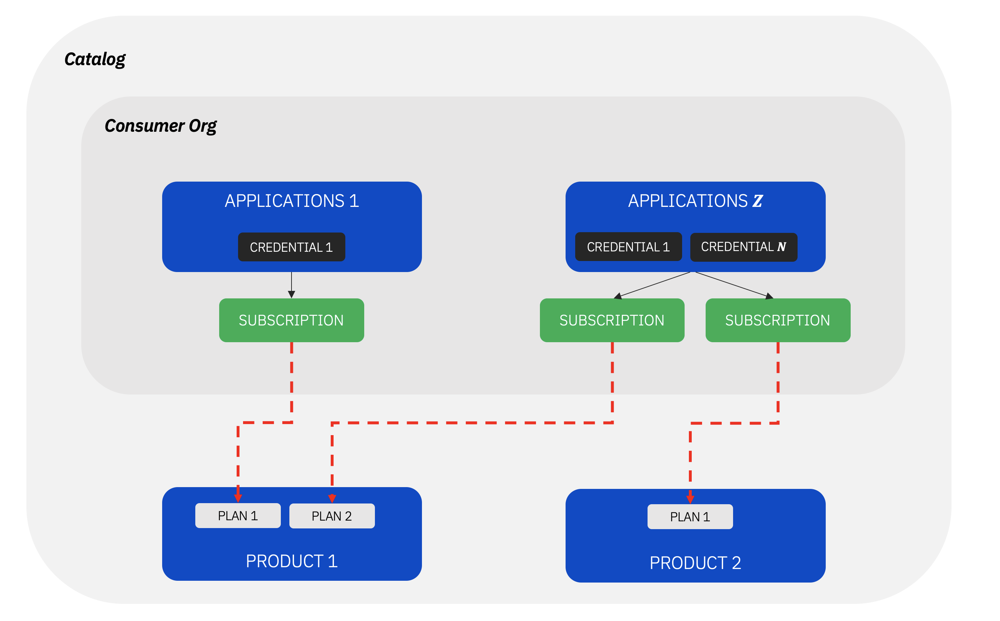

A customer of mine was using one of the earliest releases of `v10`. The standard backup and restore proceess wasn't applicable due to several reasons. 

The goal was to migrate `Catalogs` content from the current deployment to the new eus deployment - `v10.0.1.5-eus` at the time.


The process was tricky because of the dependencies between the artifacts. The below diagram illistrates them in high level.




I decided to breakdown the process in 2 stage in order to minimize the errors on the source-instance:

## Stage 1: Export from the source-instance

* Backup encryption-secret

```bash
$ oc get secret management-enc-key -n <APIC-namespace> -o yaml > management-enc-key.yaml
```

* Backup Management client application credential secrets

```bash
$ oc get mgmt -n <APIC-namespace> -o yaml | grep CredentialSecret
```

For every item in the list, perform:

```bash
$ oc get secret <secret_name> -n <APIC-namespace> -o yaml > <secret_name>.yaml
```

> You must edit each of the saved YAML files and remove both the ownerReferences subsection and the selfLink property.


* Login to API Manager instance

```bash
$ apic login --username $username --password $password --server $api_mgmt --realm $realm 
```

* Clone APIs & Products

```bash
$ mkdir product && cd "$_"
$ apic products:clone --scope space -s $api_mgmt -o $api_org -c $catalog --space $space
```

* Clone users, and do the requried changes

```bash
$ users=$(apic users:list -s $api_mgmt -o $api_org --user-registry $lur | sed "s| .*||"))
$ userarray=($users)
```

```bash
$ mkdir users && cd "$_"
for user in "${userarray[@]}"; do
   
    apic users:get $user -s $api_mgmt -o $api_org --user-registry $lur

    # remove identity_provider:
    sed -i '/identity_provider/d' $user.yaml

    # append the default password to the user yaml
    echo "password: 7iron-hide" >> $user.yaml
done
```

* Clone consumer orgs, associate apps, credentials and subscriptions

```bash
$ mkdir corgs && cd "$_"
for corg in $(apic consumer-orgs:list --server $api_mgmt -o $api_org -c $catalog | sed "s| .*||"); do
  
    mkdir $corg  
	cd $corg

    apic consumer-orgs:get $corg -s $api_mgmt -o $api_org -c $catalog

    for app in $(apic apps:list --server$api_mgmt -o $api_org -c $catalog --consumer-org $corg --space $space --space-initiated | sed "s| .*||"); do
        
            mkdir $app  
            cd $app
    ​
                # get app per consumer org
                apic apps:get $app.yaml --server $api_mgmt -o $api_org -c $catalog--consumer-org $corg 
    ​
                mkdir creds 
                cd creds
                    # get cred per app
                    for cred in $(apic credentials:list--server $api_mgmt -o $api_org -c $catalog --consumer-org $corg -a $app | sed "s| .*||"); do
                        apic credentials:get $cred.yaml --server $api_mgmt -o $api_org -c $catalog --consumer-org $corg -a $app
                    done
                cd ..  
    ​
                mkdir subs  
                cd subs
    ​
                    # get products name
                    apic products:list-all --scope space -s $api_mgmt -o $api_org -c $catalog --space $src_space > prod-name-id.txt
    ​
                    # get subs per app
                    for sub in $(apic subscriptions:list --server $api_mgmt -o $api_org -c $catalog --consumer-org $corg -a $app | sed "s| .*||"); do
                            apic subscriptions:get $sub.yaml --server $api_mgmt -o $api_org -c $catalog --consumer-org $corg -a $app
                    done
    ​
            cd ../..
    done
	cd ..
done
```
        


## Stage 2: Import to the target-instance


* Apply the Management and Portal encryption secrets to the cluster where you will install API Connect

```bash
$ oc apply -f mgmt-enc-key.yaml
```

* Add the saved Management encryption secrets to the installation CR

```yaml
spec:
  management:
    encryptionSecret:
      secret_name: mgmt-enc-key
```

> Install the APIConnect, and wait until it gets successfully ready

* Import Products


```bash
cd products
for product in "$(ls | head -6 )"; do
    # echo $prod
    apic products:publish $product --scope space -s $target_host -o $target_org -c $target_catalog --space $target_space
done
```

* Import users

```bash
cd users
for user in "$(ls | head -6 )"; do
    # echo $prod
    apic users:create $user -s $target_host -o $target_org --user-registry $target_lur
done
```

* Import consumers org

```bash
cd corgs
for corg in "$( ls | head-6)"; do

    # find the owner name of the corg:
    owner_src_id=$(grep users $corg | sed "s|.*users/||")
    owner_name=$(grep $owner_src_id ../users/* -l | sed "s|.yaml||" | sed "s|.*/||")

    # replace src owner url with target owner url
    target_owner_url=https://$target_host/api/user-registries/$target_org/$target_lur/users/$owner_name
    sed -i "s|https.*users.*|$target_owner_url|" $corg

    # create the corg in the target catalog
    apic consumer-orgs:create $corg -s $target_host -o $target_org -c $target_catalog
done
```

* Import apps, credentials and subscriptions

```bash
for app in $(ls -l apps/* | awk '{ print $1 }'); do
    
    sed -i '/app_credential_urls/,$d' apps/$app.yaml

    # create app
    apic apps:create apps/$app -s $target_host -o $target_org -c $target_catalog --consumer-org ${PWD##*/} 

    first=1
    for cred in $(apps/$app/creds/* | awk '{ print $1 }'); do

            if [ $first -eq 1 ]; then

                first=0
                # update cred
                apic credentials:update credential-for-$app apps/$app/creds/$cred.yaml -s $target_host -o $target_org -c $target_catalog --consumer-org ${PWD##*/} -a $app
            else
                # create cred
                apic credentials:create $cred.yaml -s $target_host -o $target_org -c $target_catalog --consumer-org ${PWD##*/}  -a $app
            fi
    done

    for sub in $(apps/$app/subs/*.yaml | awk '{ print $1 }'); do

        prod_id=$(grep \/products\/ $sub | sed "s|.*/products/||")
        prod_name_ver=$(grep $prod_id prod-name-id.txt | sed "s| .*||" | sed "s|:|/|")
        
        if [ -z "$prod_name_ver" ]; then
                continue
        fi

        target_product_url=https://$target_host/api/catalogs/$target_catalog/$target_space/products/$prod_name_ver
        sed -i "s|https.*products.*|$target_product_url|" $sub.yaml

        # create sub
        apic subscriptions:create $sub -s $target_host -o $target_org -c $target_catalog --consumer-org ${PWD##*/} -a $app
    done
done
```


For referance, always refer to official documentations [apic commands](https://www.ibm.com/docs/en/api-connect/10.0.1.x?topic=information-toolkit-command-line-tool-reference)


Shout out to the [Kai Mike Zhang](https://www.linkedin.com/in/mkz100), the above works were insprired by the orignal masterpiece he created.