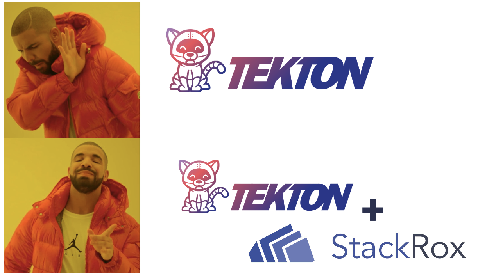

Security continues to be a critical need for enterprises adopting cloud-native development. [Tekton](https://tekton.dev/) is a cloud-native solution for building CI/CD pipeline, and [StackRox](https://www.stackrox.io/) is a full-lifecycle Kubernetes security solution, which allows you do detect, manage and mitigate security risks - StackRox is the sister project of [Red Hat Advanced Cluster Security](https://www.redhat.com/en/resources/advanced-cluster-security-for-kubernetes-datasheet). 

In the following steps, you will learn how to build a Tekton pipeline to automate: Creating [App Connect Integration Server](https://www.ibm.com/docs/en/app-connect/containers_cd) container image, Scanning the container image, and finally deploy it on OpenShift cluster.

## Get Access to StackRox deployment

```bash
export ROX_API_TOKEN=$(oc get secret central-htpasswd -n rhacs-operator --template={.data.password} | base64 -d)
export ROX_CENTRAL_HOST=$(oc get route central -n rhacs-operator --template={.spec.host})


oc apply -f - <<END
apiVersion: v1
kind: Secret
metadata:
  name: stackrox-api-config
  namespace: openshift-pipelines
type: Opaque
data:
  host: $(oc get route central -n rhacs-operator --template={.spec.host} | base64)
  api-token: $(
    curl 'https://'$ROX_CENTRAL_HOST'/v1/apitokens/generate' \
     -H 'content-type: application/json' \
     -u 'admin:'$ROX_CENTRAL_PASSWORD \
     --data-raw '{"name":"ci-pipeline","roles":["Continuous Integration"]}' \
     --compressed \
     --insecure \
   | jq -r '.token' | base64)
END
```

## Define Tekton Tasks

* **Task**: Clone Git repo, build, and push a container image to Container Registry

```yaml
apiVersion: tekton.dev/v1beta1
kind: Task
metadata:
  name: build-push-is-new-orders
  namespace: openshift-pipelines
spec:
  params:
    - default: registry.redhat.io/rhel8/buildah
      description: The location of the buildah builder image.
      name: BUILDER_IMAGE
      type: string
    - default: ./Dockerfile
      description: Path to the Dockerfile to build.
      name: DOCKERFILE
      type: string
    - default: 'false'
      description: Verify the TLS on the registry endpoint
      name: TLSVERIFY
      type: string
  resources:
    inputs:
      - name: source
        type: git
      - name: image
        type: image
  steps:
    - image: $(params.BUILDER_IMAGE)
      name: build
      resources: {}
      script: |
        . ./release
        buildah bud --storage-driver=vfs --format=oci \
          --tls-verify=$(params.TLSVERIFY) --layers \
          -f $(params.DOCKERFILE) -t $(resources.inputs.image.url) .
      securityContext:
        privileged: true
      volumeMounts:
        - mountPath: /var/lib/containers
          name: varlibcontainers
      workingDir: /workspace/source
    - image: $(params.BUILDER_IMAGE)
      name: push
      resources: {}
      script: |
        . ./release
        buildah push --storage-driver=vfs --tls-verify=$(params.TLSVERIFY) \
          $(resources.inputs.image.url) \
          'docker://$(resources.inputs.image.url)'
      securityContext:
        privileged: true
      volumeMounts:
        - mountPath: /var/lib/containers
          name: varlibcontainers
      workingDir: /workspace/source
  volumes:
    - emptyDir: {}
      name: varlibcontainers
```

* **Task**: Scan `IntegrationServer` container-image:

```yaml

apiVersion: tekton.dev/v1beta1
kind: Task
metadata:
  name: rox-image-check-v1
  namespace: openshift-pipelines
spec:
  params:
    - description: >-
        Secret containing the api-token and host data for ACS Central (example -
        api-token = <apitoken>, host = <rox.stackrox.io>)
      name: stackrox-api-config-secret-name
      type: string
    - description: Location of the file(s) to be scanned
      name: image_address
      type: string
  steps:
    - env:
        - name: ROX_API_TOKEN
          valueFrom:
            secretKeyRef:
              key: api-token
              name: $(params.stackrox-api-config-secret-name)
        - name: ROX_CENTRAL_HOST
          valueFrom:
            secretKeyRef:
              key: host
              name: $(params.stackrox-api-config-secret-name)
      image: registry.access.redhat.com/ubi8/ubi
      name: rox-image-scanner
      resources: {}
      script: >
        #!/usr/bin/env bash
        set +x
        export NO_COLOR="True"

        curl -s -k -L -H "Authorization: Bearer $ROX_API_TOKEN" https://$ROX_CENTRAL_HOST/api/cli/download/roxctl-linux --output ./roxctl

        curl -L https://github.com/stedolan/jq/releases/download/jq-1.6/jq-linux64 -o jq

        chmod +x ./roxctl ./jq 

        ./roxctl image scan --insecure-skip-tls-verify -e
        "https://$ROX_CENTRAL_HOST:443" --image "$(params.image_address)"
        --output "json" > result.json 

        if [ $(./jq '.result.summary.IMPORTANT' result.json) -ge 1 ]; then exit 1; fi
```


* **Task**: Create an `IntegrationServer` instance

```yaml
apiVersion: tekton.dev/v1beta1
kind: Task
metadata:
  name: deploy-is-new-orders
  namespace: openshift-pipelines
spec:
  resources:
    inputs:
      - name: image
        type: image
  steps:
    - image: 'quay.io/openshift/origin-cli:latest'
      name: deploy
      resources: {}
      script: |
        cat << EOF | oc apply -f -
            apiVersion: appconnect.ibm.com/v1beta1
            kind: IntegrationServer
            metadata:
              name: new-order-app-demo-01
              namespace: cp4i
            spec:
              enableMetrics: true
              license:
                accept: true
                license: L-APEH-C79J9U
                use: CloudPakForIntegrationNonProduction
              pod:
                containers:
                  runtime:
                    image: $(resources.inputs.image.url)
                    imagePullPolicy: Always
                    resources:
                      limits:
                        cpu: 300m
                        memory: 350Mi
                      requests:
                        cpu: 300m
                        memory: 300Mi
              adminServerSecure: false
              router:
                timeout: 120s
              designerFlowsOperationMode: disabled
              createDashboardUsers: true
              service:
                endpointType: http
              replicas: 1
              version: 12.0.3.0-r1
        EOF
```


## Define Tekton Pipeline Resources

* **PipelineResource**: type git server

```yaml
apiVersion: tekton.dev/v1alpha1
kind: PipelineResource
metadata:
  name: git-is-new-orders
  namespace: openshift-pipelines
spec:
  params:
    - name: revision
      value: main
    - name: url
      value: 'https://github.com/RashidAljohani/New-Orders-Service.git'
  type: git
```

* **PipelineResource**: type container image

```yaml
apiVersion: tekton.dev/v1alpha1
kind: PipelineResource
metadata:
  name: image-is-new-orders
  namespace: openshift-pipelines
spec:
  params:
    - name: url
      value: 'quay.io/rashid_aljohani/is-new-orders:0.1'
  type: image
```

## Define Tekton Pipeline 

* **Pipeline**: describe the pipeline flow

```yaml
apiVersion: tekton.dev/v1beta1
kind: Pipeline
metadata:
  name: rox-pipeline-v1
  namespace: openshift-pipelines
spec:
  resources:
    - name: git-resource
      type: git
    - name: image-resource
      type: image
  tasks:
    - name: build-push
      resources:
        inputs:
          - name: source
            resource: git-resource
          - name: image
            resource: image-resource
      taskRef:
        kind: Task
        name: build-push
    - name: deploy-app
      resources:
        inputs:
          - name: image
            resource: image-resource
      runAfter:
        - image-scanner
      taskRef:
        kind: Task
        name: deploy-app
    - name: image-scanner
      params:
        - name: stackrox-api-config-secret-name
          value: stackrox-api-config
        - name: image_address
          value: 'quay.io/rashid_aljohani/is-new-orders:0.1'
      runAfter:
        - build-push
      taskRef:
        kind: Task
        name: rox-image-check-v1
```


## Define Tekton PipelineRun

```yaml
apiVersion: tekton.dev/v1beta1
kind: PipelineRun
metadata:
  name: rox-pipeline-v1
  namespace: openshift-pipelines
spec:
  pipelineRef:
    name: rox-pipeline-v1
  resources:
    - name: git-resource
      resourceRef:
        name: git-resource
    - name: image-resource
      resourceRef:
        name: image-resource
  serviceAccountName: pipeline-bot
  timeout: 1h0m0s
```

