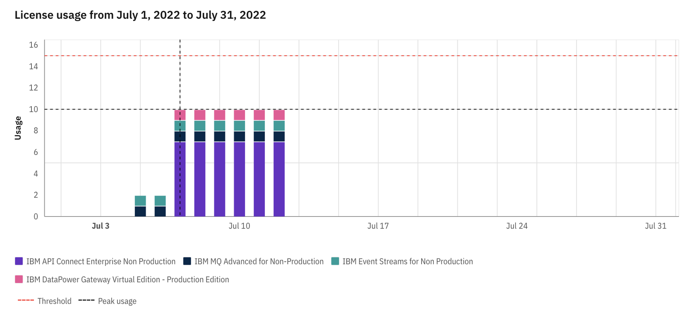

I always advise using the `ibm-licensing-operator` for better tracking consumption. The tool is part of IBM Cloud Pak foundational services, and provides information about license usage of IBM containerized products and IBM Cloud Paks per cluster. Also, you can retrieve license usage data through a dedicated API call and generate an audit snapshot on demand.



## Supported platforms

Red Hat OpenShift Container Platform 4.2 or newer installed on Linux x86_64, Linux on Power (ppc64le), Linux on IBM Z and LinuxONE.

You can deploy License Service on other Kubernetes-orchestrated clouds to collect license usage of IBM stand-alone containerized software. For deployment instructions and the full list of supporter platforms, see [License Service for stand-alone products](https://github.com/IBM/ibm-licensing-operator/blob/latest/docs/License_Service_main.md).


## Deploy License Service Operator

```bash
cat <<EOF | kubectl apply -f -
apiVersion: operator.ibm.com/v1alpha1
kind: OperandRequest
metadata:
  name: ibm-licensing-operator
  namespace: ibm-common-services
spec:
  requests:
    - operands:
        - name: ibm-licensing-operator
      registry: common-service
EOF
```

## Deploy License Service Reporter

```bash
cat <<EOF | kubectl apply -f -
apiVersion: operator.ibm.com/v1alpha1
kind: IBMLicenseServiceReporter
metadata:
  name: instance
  namespace: ibm-common-services
spec:
  version: 1.16.0
EOF
```


## Validate the License Service Reporter deployment

```bash
$ kubectl get pods --all-namespaces | grep -E  'ibm-license*'
```

The following response is a confirmation of successful deployment:

```bash
ibm-common-services                                ibm-license-service-reporter-instance-5b4966d66-wxjhx             3/3     Running     0               7d
ibm-common-services                                ibm-licensing-operator-5857b58b69-zfl2d                           1/1     Running     0               7d
ibm-common-services                                ibm-licensing-service-instance-db465fb9b-58b4m                    1/1     Running     0               7d
```
