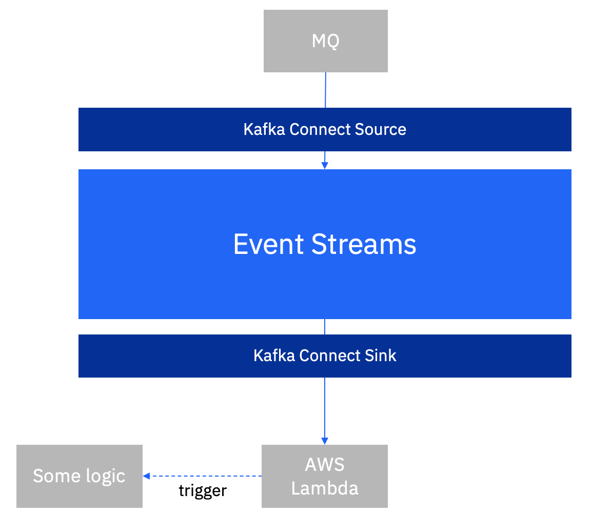

[Apache Camel](https://camel.apache.org/) provides a mature integration framework that empowers you to quickly and easily integrate various systems consuming or producing data. On the other hand, [Kafka](https://kafka.apache.org/) provides a distributed streaming platform that enables the development of real-time and event-driven applications. How powerful will it be if both frameworks work together? 

Apache Camel has just [released](https://camel.apache.org/blog/Camel-Kafka-connector-release-0.1.0/) a set of connectors which can be used to leverage the broad ecosystem of Camel in Kafka Connect. In the follow steps you will learn how to use Apache Camel connectors in a Kafka environment - [IBM Event Streams](https://ibm.github.io/event-streams/about/overview/)

# Demo flow



> I will use MQ Source to publish events in a Kafka topic, and then use AWS Lambda Sink to trigger a serverless function.


* Create a secret for allow accessing AWS services

```bash
cat <<EOF | kubectl apply -f -
apiVersion: v1
kind: Secret
metadata:
  name: aws-credentials
type: Opaque
stringData:
  connector.properties: |-
    accessKey: xxxxxxxxxxxxx
    secretKey: xxxxxxxxxxxxx
EOF
```

* Download KafkaConnector libraries and dependencies, in my case it was [MQ Source](https://ibm.github.io/event-streams/connecting/mq/source/), and [Apache Camel AWS Lambda Sink](https://camel.apache.org/camel-kafka-connector/1.0.x/reference/connectors/camel-aws-lambda-sink-kafka-sink-connector.html)

* Create custom KafkaConnect image

```dockerfile
FROM cp.icr.io/cp/ibm-eventstreams-kafka:10.5.0
COPY ./my-plugins/ /opt/kafka/plugins/
USER 1001
```

> Place the KafkaConnector libraries and dependencies inside `my-plugins` folder

> If your connector consists of multiple JAR files, create a directory for the connector inside the my-plugins directory and copy all of the connector’s JAR files into that directory. For example, place Lambda sink jar files inside `/my-plugins/lambda-sink/`

Here’s an example of how the directory structure might look with 2 connectors:

```
+--  my-plugins/
|    +--  mq-source.jar
|    +--  lambda-sink/
|    |    +-- connector-lib-1.jar
|    |    +-- connector-lib-2.jar
|    |    +-- connector-lib-3.jar
```

* Build, Tag, Push the container image

```bash
$ docker build -t my-connect-cluster:1.0 .
$ docker tag my-connect-cluster:1.0 quay.io/rashid_aljohani/my-connect-cluster:1.0
$ docker push quay.io/rashid_aljohani/my-connect-cluster:1.0
```

* Create KafkaConnect enviroment with the customs image

```yaml
apiVersion: eventstreams.ibm.com/v1beta2
kind: KafkaConnect
metadata:
  name: my-connect-cluster
  annotations:
    eventstreams.ibm.com/use-connector-resources: "true"
spec:
  version: 2.8.1
  replicas: 1
  bootstrapServers: es-lite-kafka-bootstrap.cp4i.svc:9092
  image: quay.io/rashid_aljohani/my-connect-cluster:1.0
  template:
    pod:
      imagePullSecrets: []
      metadata:
        annotations:
          eventstreams.production.type: CloudPakForIntegrationNonProduction
          productID: 2a79e49111f44ec3acd89608e56138f5
          productName: IBM Event Streams for Non Production
          productVersion: 11.0.3
          productMetric: VIRTUAL_PROCESSOR_CORE
          productChargedContainers: my-connect-cluster-connect
          cloudpakId: c8b82d189e7545f0892db9ef2731b90d
          cloudpakName: IBM Cloud Pak for Integration
          cloudpakVersion: 2022.2.1
          productCloudpakRatio: "2:1"
  config:
    group.id: connect-cluster
    offset.storage.topic: connect-cluster-offsets
    config.storage.topic: connect-cluster-configs
    status.storage.topic: connect-cluster-status
    config.storage.replication.factor: 1
    offset.storage.replication.factor: 1
    status.storage.replication.factor: 1
  externalConfiguration:
    volumes:
      - name: aws-credentials
        secret:
          secretName: aws-credentials
```

> The intance is using the custom image via `spec.image`

> The intance enables the use of KafkaConnectors via `metadata.annotations.eventstreams.ibm.com/use-connector-resources: "true"`

> The Secret is mounted via `spec.externalConfiguration`, files will store at `/opt/kafka/external-configuration/`


* Create MQ Source Kafka Connector intance

```yaml
apiVersion: eventstreams.ibm.com/v1beta2
kind: KafkaConnector
metadata: 
  name: mq-source-connector 
  labels: 
    eventstreams.ibm.com/cluster: my-connect-cluster
spec:
  class: MQSourceConnector
  tasksMax: 1
  pause: false
  config:
    mq.queue.manager: QM1
    mq.connection.name.list: qm-lite-ibm-mq.cp4i.svc.cluster.local(1414)
    mq.channel.name: MVP.ES.SVRCONN
    mq.queue: MVP.FROM.ACE.Q
    topic: connect-mq-source
    mq.connection.mode: client
    mq.record.builder: com.ibm.eventstreams.connect.mqsource.builders.JsonRecordBuilder
    key.converter: org.apache.kafka.connect.json.JsonConverter
    value.converter: org.apache.kafka.connect.json.JsonConverter
```


* Create AWS Lambda Sink Kafka Connector intance

```yaml
apiVersion: eventstreams.ibm.com/v1beta2
kind: KafkaConnector
metadata: 
  name: lambda-sink-connector 
  labels: 
    eventstreams.ibm.com/cluster: my-connect-cluster
spec:
  class: org.apache.camel.kafkaconnector.awslambdasink.CamelAwslambdasinkSinkConnector
  tasksMax: 1
  config:
    key.converter: org.apache.kafka.connect.storage.StringConverter
    value.converter: org.apache.kafka.connect.storage.StringConverter
    topics: connect-mq-source
    camel.kamelet.aws-lambda-sink.accessKey: ${file:/opt/kafka/external-configuration/aws-credentials/connector.properties:accessKey}
    camel.kamelet.aws-lambda-sink.secretKey: ${file:/opt/kafka/external-configuration/aws-credentials/connector.properties:secretKey}
    camel.kamelet.aws-lambda-sink.region: ap-south-1
    camel.kamelet.aws-lambda-sink.function: my-backend
```