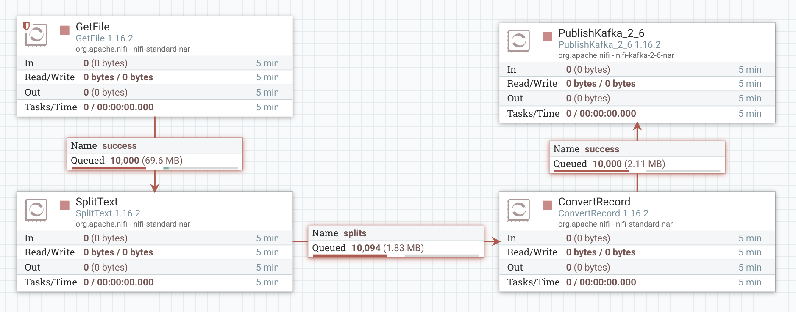
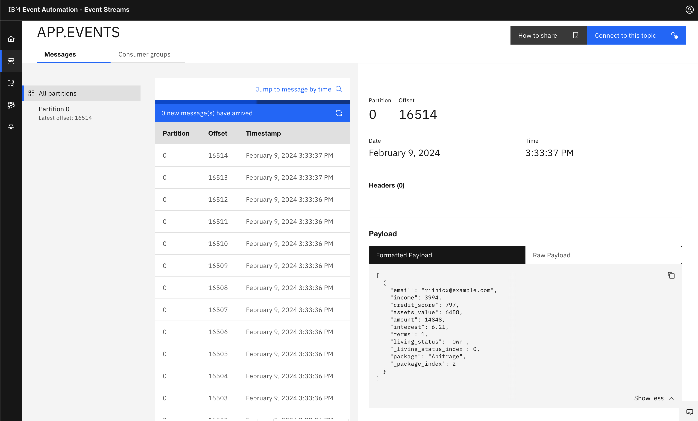
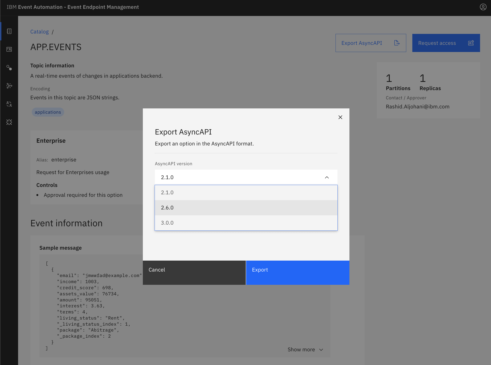
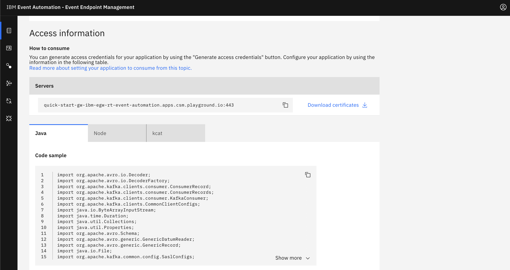

Today, I will explore another way to process content and emit data to Kafka environments, regardless of its complexity.

More specifically, I will be using a tool called NiFi or Niagarafiles. It is an [open-source](https://github.com/apache/nifi) project that automates the flow of data between systems. _"Automates the flow of data"_ is a big statement, and indeed, I will not cover it all in this post. However, I aim to explore NiFi's capabilities that help process content in real-time and feed it to Kafka environments.

#### Let's start by defining and scoping the problem statement:
* **Requirement 1**: Your team generates a large `CSV` file. You are asked to extract each line, convert it to `JSON`, and then emit each line as an event to a Kafka environment.
* **Requirement 2**: Your team aims to socialize the content using the [AsyncAPI specifications](https://www.asyncapi.com/) rather than a File-based approach; aka `CSV` files.


### Technology stack

1. [Event Streams](https://www.ibm.com/products/event-streams): an event streaming platform built on open source Apache Kafka.
2. [Apache Nifi](https://nifi.apache.org/): an open-source tool that facilitates processing and distribute data.
3. [Event Endpoint Management](https://www.ibm.com/blog/a-quick-tour-of-ibm-event-endpoint-management/): a capability to describe, catalog, and socialize the APIs of Kafka event sources using AsyncAPI specifications.


## Steps

### Prepare the environments

You can use the following instructions to get started:

1. [IBM Event Stream Deployment](https://ibm.github.io/event-automation/es/).
2. [Apache NiFi on OpenShift](https://github.com/guimou/nifi-on-openshift).
3. [IBM Endpoint Management](https://ibm.github.io/event-automation/eem/).


### Integrating and Transforming File-based Content

 

* Start with [GetFile](https://nifi.apache.org/docs/nifi-docs/components/org.apache.nifi/nifi-standard-nar/1.9.2/org.apache.nifi.processors.standard.GetFile/index.html) processor, which fetches files in a directory. Then, double-click to get to the processor's configuration section.
* Update the following properties:
    - **Input Directory**: the input directory from which to pull the CSV file, e.g., `/tmp/data`
    - **Batch Size**: change to `1` so it will handle one file at a time.
    - **Keep Source File**: change to `true`, so we keep the original files.

###### This is an example of the CSV content
```
email,income,credit_score,assets_value,amount,interest,terms,living_status,_living_status_index,package,_package_index
femjf@example.com,9100,490,27586,86813,3.31,3,Rent,1,Currency ETFs,6
dttndsapcr@example.com,9460,493,65851,30303,7.47,3,Rent,1,Abitrage,2
pnqhh@example.com,6300,702,49112,94802,5.87,9,Rent,1,Stock ETFs,7
ozwdfnace@example.com,7640,879,45176,15303,6.02,10,Rent,1,Mutual Fund,5
lhmmm@example.com,6485,789,77850,59253,4.6,5,Own,0,Fixed Rate Bonds,4
```

* Add another [SplitText](https://nifi.apache.org/documentation/nifi-2.0.0-M1/components/org.apache.nifi/nifi-standard-nar/2.0.0-M1/org.apache.nifi.processors.standard.SplitText/index.html) in the canvas. Then, connect the `GetFile` node with the `SplitText` node. The `SplitText` will extract each line from the `CSV`.
* Update `SplitText` configuration with the following:
    - **Line Split Count**: to `1`.
    - **Header Line Count**: to `1`.
* Now, you want to parses the new content to `JSON` format by adding [ConvertRecord](https://nifi.apache.org/docs/nifi-docs/components/org.apache.nifi/nifi-standard-nar/1.6.0/org.apache.nifi.processors.standard.ConvertRecord/index.html) in the canvas. Then, connect the `SplitText` node with the `ConvertRecord` node.
* Update the `ConvertRecord` configuration with the following:
    - **Record Reader**: CSVReader.
    - **Record Writer**: JsonRecordSetWriter.
* Finally, let's use [PublishKafka](https://nifi.apache.org/docs/nifi-docs/components/org.apache.nifi/nifi-kafka-2-0-nar/1.24.0/org.apache.nifi.processors.kafka.pubsub.PublishKafka_2_0/additionalDetails.html) processor to emit the new content to a Kafka topic. Adjust the `PublishKafka` configuration to connect to your cluster.


Here is the result of converting the large `CSV` file into a small chunks of `JSON` events.

 


### Socializing your Kafka event sources

[Event endpoint management](https://ibm.github.io/event-automation/eem/about/overview/) provides the functionality to describe and catalog your Kafka topics as event sources, and to share the details of the topics with application developers.

Application developers can discover the event source and configure their applications to subscribe to the stream of events, providing self-service access to the message content from the event stream.

Here are the 3 steps you need to do that:

1. [Describing event sources](https://ibm.github.io/event-automation/eem/describe/adding-topics/).
2. [Managing topics](https://ibm.github.io/event-automation/eem/describe/managing-topics/).
3. [Discovering topics](https://ibm.github.io/event-automation/eem/consume-subscribe/discovering-topics/).


Application developers can view, subscribe and consume event data using the [AsyncAPI specifications](https://ibm.github.io/event-automation/eem/integrating-with-apic/export-asyncapi/).

 


