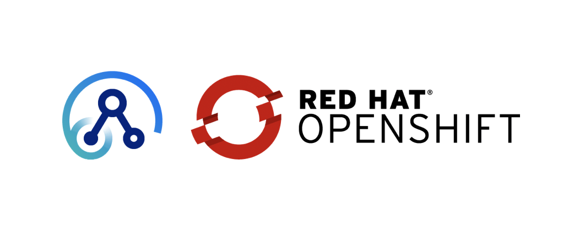

It is fascinating how integration patterns are transforming toward more light and agile type of architecture. I see cloud-native development approach plays a vital role in this, where each integration service is becoming independent and elastic. 

Let's demonstrates that by deploying [App Connect](https://www.ibm.com/support/knowledgecenter/en/SSTTDS_11.0.0/com.ibm.etools.mft.doc/bb43020_.htm) Server on the [OpenShift](https://www.openshift.com) platform. There are two main steps:

* Install [Helm](https://helm.sh/) on OpenShift
* Deploy App Connect via IBM charts


## Install Helm

1. download Helm client
```bash
source /dev/stdin <<< "$(curl -s https://storage.googleapis.com/kubernetes-helm/helm-v2.9.0-linux-amd64.tar.gz | tar xz)"
```
2. create OpenShift project for Helm server (`tiller`)
```
oc new-project tiller
```

3. set the tiller project/namespace .. that will enable Helm client to fetch the server-side
```bash
export TILLER_NAMESPACE=tiller
```

4. initialize Helm client
```
cd linux-amd64
./helm init
```

5. set the service-account for Helm server to give it the required access privileges
```bash
oc process -f https://github.com/openshift/origin/raw/master/examples/helm/tiller-template.yaml -p TILLER_NAMESPACE="${TILLER_NAMESPACE}" -p HELM_VERSION=v2.9.0 | oc create -f -
```

6. verify Helm client and server deployment
```bash
./helm version
Client: &version.Version{SemVer:"v2.9.0", GitCommit:"f6025bb9ee7daf9fee0026541c90a6f557a3e0bc", GitTreeState:"clean"}
Server: &version.Version{SemVer:"v2.9.0", GitCommit:"f6025bb9ee7daf9fee0026541c90a6f557a3e0bc", GitTreeState:"clean"}
```


## Deploy App Connect

1.  create a project/namespace
```
oc new-project ace
```

2. grant tiller to access the project
```bash
oc policy add-role-to-user edit "system:serviceaccount:${TILLER_NAMESPACE}:tiller"
```

3. apply SCC to enable ace with the necessary access permissions
```bash
oc create -f https://raw.githubusercontent.com/IBM/cloud-pak/master/spec/security/scc/ibm-anyuid-scc.yaml
```

4. create a service-account for to blind the SCC with ace deployment 
```bash
oc create sa ibm-ace-sa
```

5. add the SCC to the service account
```bash
oc adm policy add-scc-to-user ibm-anyuid-scc -z ibm-ace-sa
```

7. add IBM charts to your local repo
```bash
helm repo add stable https://raw.githubusercontent.com/IBM/charts/master/repo/stable
```

8. load App Connect image to local docker registry
```bash
docker load -i ibm-ace-server-11.0.0.5.tar.gz
```

9. tag App Connect image with your registry host
```bash
docker tag ibm-ace-server:11.0.0.5 docker-registry.default.svc:5000/ace/ibm-ace-server:11.0.0.5
```

10. push App Connect image to cluster registry
```bash
docker push docker-registry.default.svc:5000/ace/ibm-ace-server:11.0.0.5
```

11. deploy App Connect 
```bash
helm install --name ace-dev stable/ibm-ace-server-dev --set license=accept --set image.repository.aceonly={docker-repo/ace-image-name} --set image.tag={image-tag}
```
* ` you may update the chart values: image path & tag via the cli`

12. verify the deploymnet
```
oc get pod
```


the result should similar to this

```
NAME                            READY     STATUS    RESTARTS   AGE
ace-ibm-ace-5dcd4976f7-2jzqt    1/1       Running   0          6m
ace-ibm-ace-5dcd4976f7-k4vb5    1/1       Running   0          7m
ace-ibm-ace-5dcd4976f7-xdk6t    1/1       Running   0          7m
tiller-deploy-9d8996745-j5vxq   1/1       Running   0          4h
```


Big shout out to [Rob Convery](https://www.linkedin.com/in/rob-convery-724aa1b4/) and his team for the well documented resources: [ace-helm](https://github.com/ot4i/ace-helm/tree/master/ibm-ace) & [ace-docker]()