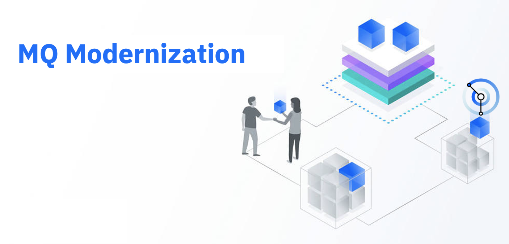

A few weeks back, one of my customers asked me the possibility to configure MQ clusters across multiple environments - as part of the modernization journey to moving MQ gradually from legacy infrastructure to containerization environments.


The following steps will assist you in deploying a [queue managers cluster](https://www.ibm.com/docs/en/ibm-mq/9.2?topic=clusters-designing) that spins around two environments.


## Receiver side (Cloud environment)

* Create configMap with the mqsc details

```bash
ALTER QMGR CHLAUTH(DISABLED)
ALTER QMGR REPOS(SOLARSYS)

DEFINE CHANNEL(TO.OCP.CLUS) +
CHLTYPE(CLUSRCVR) + 
TRPTYPE(TCP) +
SSLCAUTH(OPTIONAL) +
SSLCIPH('ANY_TLS12_OR_HIGHER') +
CLUSTER(SOLARSYS) REPLACE

SET CHLAUTH(SECUREQMCHL) TYPE(BLOCKUSER) USERLIST('nobody') ACTION(ADD)
START CHANNEL(TO.OCP.CLUS)
```


* Create certs for tls connection

```bash
$ oc create secret generic qm-ocp-certs --from-file=personal-certificate.crt=./certs/certificate.crt --from-file=personal-certificate.key=./certs/private.key
```
> You must enable TLS on your IBM MQ queue manager and client application, because Server Name Indication (SNI) is only available in the TLS protocol. 

* Create QueueManager CR

```yaml
apiVersion: mq.ibm.com/v1beta1
kind: QueueManager
metadata:
  name: mq-ocp
  namespace: mq-demo
spec:
  license:
    accept: true
    license: L-RJON-BZFQU2
    use: NonProduction
  pki:
    keys:
      - name: ibmwebspharemq
        secret:
          items:
            - personal-certificate.crt
            - personal-certificate.key
          secretName: qm-ocp-certs
  web:
    enabled: true
  version: 9.2.3.0-r1
  template:
    pod:
      containers:
        - env:
            - name: MQSNOAUT
              value: 'yes'
          name: qmgr
  queueManager:
    resources:
      limits:
        cpu: 500m
      requests:
        cpu: 500m
    name: QM1
    mqsc:
      - configMap:
          items:
            - property.mqsc
          name: qm-ocp-mqsc
    storage:
      queueManager:
        type: ephemeral

```

* Create custom channel route; i.e. channel name `TO.QMGR1` maps to an SNI address of `to2e-qmgr1.chl.mq.ibm.com` .. in our case, the `TO.OCP.CLUS` will be equivalent to `to2e-ocp2e-clus.chl.mq.ibm.com`; to be used in the sender side.


## Sender side (Legacy environment)

* Setup the mqsc configurations

```bash
ALTER QMGR CHLAUTH(DISABLED)
ALTER QMGR REPOS(SOLARSYS)

DEFINE CHANNEL(TO.OCP.CLUS) +
CHLTYPE(CLUSSDR) +
TRPTYPE(TCP) + 
CONNAME('mq-ocp-ibm-mq-qm-mq-demo.apps.example.io(443)') + 
SSLCIPH('ANY_TLS12_OR_HIGHER') +
CLUSTER(SOLARSYS) REPLACE

SET CHLAUTH(SECUREQMCHL) TYPE(BLOCKUSER) USERLIST('nobody') ACTION(ADD)
START CHANNEL(TO.OCP.CLUS)
```

> Note that we are using 443 instead of 1414

* Load the TLS certifcats
* Start QM manager and the channel