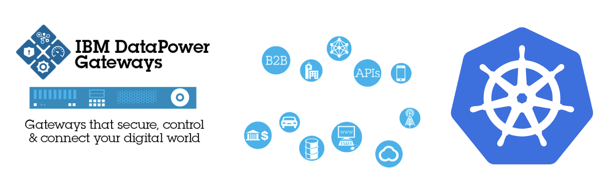

For operation or administration reasons, you may want to enable DataPower Web UI in your Kubernetes cluster. 

Below are the 4 steps you need to perform that:

* Create `ConfigMap` to persis DataPower Configuration

```bash
cat <<EOF | kubectl apply -f -
kind: ConfigMap
apiVersion: v1
metadata:
  name: dp-webui-config
data:
  datapower.cfg: |
    # configuration to enable web-mgmt and xml-mgmt
    top; configure terminal;
    web-mgmt
      admin-state enabled
      idle-timeout 9000
    exit
    xml-mgmt
      admin-state enabled
    exit
EOF
```


* Patch the deployment DataPowerService with `ConfigMap`

```yaml
...
  domains:
      dpApp:
        config:
            - dp-webui-config # from step 1
            - apis-minimum-gw-default-domain-config
..
```

* Get DataPower Admin password

```bash
$ oc get secret $(oc get secret |  grep gw-admin | awk '{ print $1 }') --template="{.data.password}" | base64 -d 
```

* Create the Web UI Route

```bash
$ oc create route passthrough --service=<gw-datapower-service> --port=9090
```