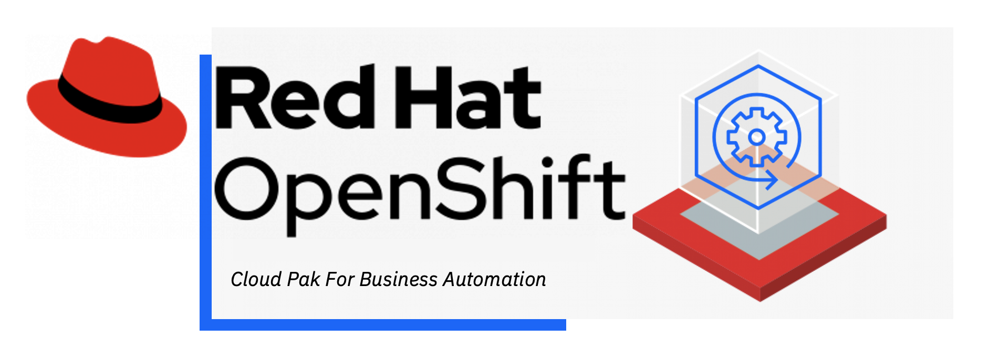
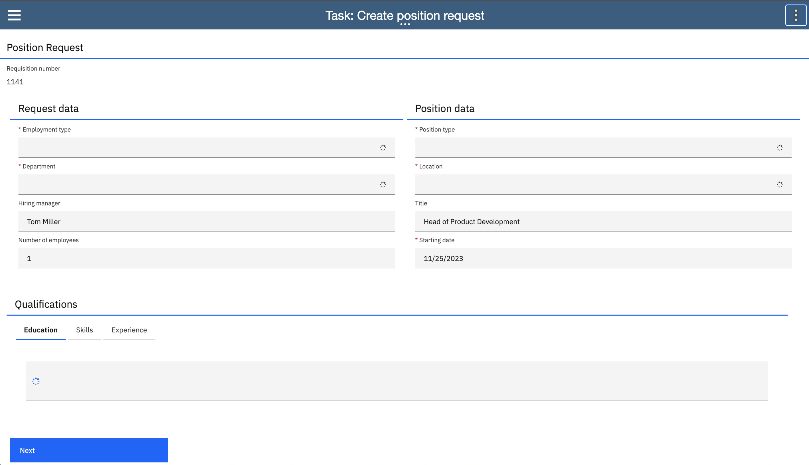
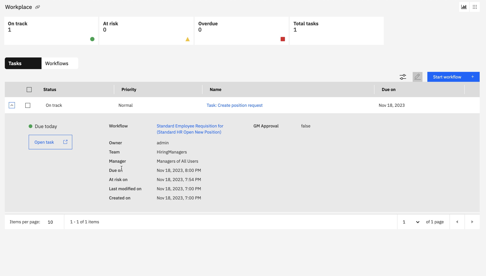
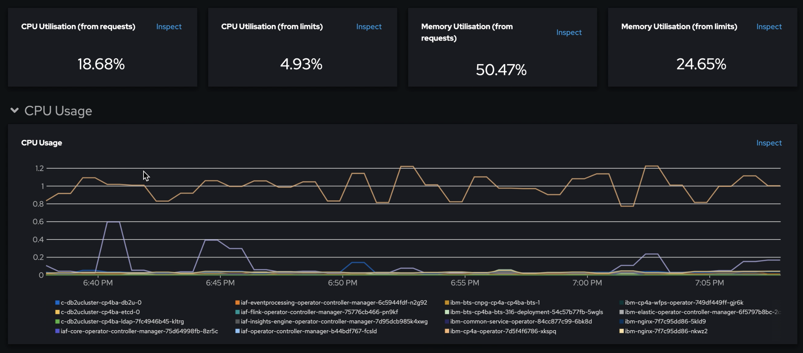
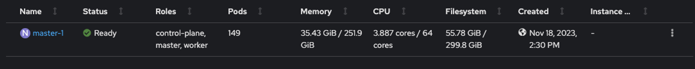

In my previous blog, I discussed about [Red Hat Single Node Openshift](https://www.redhat.com/en/blog/meet-single-node-openshift-our-smallest-openshift-footprint-edge-architectures)  and how to extend executing applications in a distributed computing framework.


I will explore IBM Business Workflow Services in a Single Node Openshift deployment in this blog. The services are part of [IBM Cloud Pak for Business Automation](https://www.ibm.com/products/cloud-pak-for-business-automation). It is a modular set of integrated software components built for a hybrid cloud, designed to automate work and accelerate business growth.

The platform allows digitizing business operations such as content, workflow, decisions, and capture. In my experiment, I focused on the [workflow](https://www.ibm.com/docs/en/cloud-paks/cp-biz-automation/23.0.1?topic=capabilities-workflow) component.


## Steps

### Setup Single Node OpenShift:

I used the following hardware specifications:

* 64 vCPU cores
* 250GB of RAM
* 300GB Storage

You can refer to the official guide for the deployment: [Installing OpenShift on a single node](https://docs.openshift.com/container-platform/4.13/installing/installing_sno/install-sno-installing-sno.html).


### Storage layer

You will need to provide `file` and `block` storage classes.

Here are some options:

* If you run on a public cloud, I prefer using their storage ecosystem such as AWS EBS or Azure Disk.
* Otherwise, you can consider other options, such as [LVM Operator](https://github.com/openshift/lvm-operator), [Rook Ceph](https://github.com/rook/rook), or [NFS server](https://github.com/kubernetes-sigs/nfs-subdir-external-provisioner).


### Prepare the OpenShift for Cloud Pak for Business Automation deployment

* Create a new project

```
oc new-project cp4a
```

* Create a `cp4a` user

> You can use any other supported method. I used htpasswd for simplicity :)

```
htpasswd -c -B -b ./users.htpasswd cp4a password
```

```
oc create secret generic htpass-secret --from-file=htpasswd=./users.htpasswd -n openshift-config
```

```bash
cat << EOF | oc apply -f -
apiVersion: config.openshift.io/v1
kind: OAuth
metadata:
  name: cluster
spec:
  identityProviders:
  - name: my_htpasswd_provider 
    mappingMethod: claim 
    type: HTPasswd
    htpasswd:
      fileData:
        name: htpass-secret 
  EOF   
```

```
oc login -u cp4a
```

```
oc whoami
```

* Create the entitlement key

```
oc create secret docker-registry ibm-entitlement-key \
    --docker-username=cp \
    --docker-password=myEntitlementKey \
    --docker-server=cp.icr.io \
    --namespace=myNamespace
```

> You can find the key in the [MyIBM Container Software Library](https://myibm.ibm.com/products-services/containerlibrary)

* Create a serviceAccount

```bash
cat << EOF | oc apply -f -
apiVersion: v1
kind: ServiceAccount
metadata:
  name: ibm-cp4ba-anyuid
imagePullSecrets:
- name: "ibm-entitlement-key"
EOF 
```

* Bind the security context constraints to the serviceAccount

```
oc adm policy add-scc-to-user anyuid -z ibm-cp4ba-anyuid
```


* Download the [cert-kubernetes repository](https://www.ibm.com/links?url=https%3A%2F%2Fgithub.com%2FIBM%2Fcloud-pak%2Fraw%2Fmaster%2Frepo%2Fcase%2Fibm-cp-automation%2F5.0.0%2Fibm-cp-automation-5.0.0.tgz).

* Extract the contents from the `.tar`file in the `ibm-cp-automation/inventory/cp4aOperatorSdk/files/deploy/crs` folder.

* Run `./cp4a-clusteradmin-setup.sh` script.

> The **starter** deployment provisions PostgreSQL and OpenLDAP with the default values, so you do not need to prepare them in advance.

#### Install Cloud Pak for Business Automation

* Run `./cp4a-deployment.sh` script.
* Follow the script's instruction by providing the required information such as:

- "_Is this a new installation or an existing installation?_" **New**
- "_What type of deployment is being performed?_" **Starter**
- "_Select the cloud platform to deploy_" **Openshift Container Platform (OCP) - Private Cloud**

In a later stage, you will be asked which capabilities you want to deploy ... in my case, I used **Workflow Authoring and Workstream Services** (_Option 5_). You can choose the same or try something different.


### Results


* Business Automation Workflow: Studio


* Business Automation Workflow: Workplace


* Deployment usage


* OpenShift usage (idle state)



Shout out to [Lamiaa Said](https://www.linkedin.com/in/lamiaa-said-elmahmoudy/) for the deployment support.