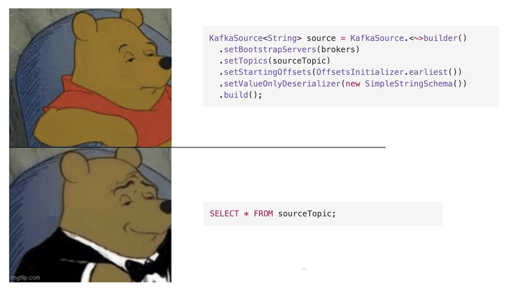

In my [last blog](https://rashidaljohani.github.io/interact-with-IBM-MQ-messages-via-Streaming-app/), I used [Apache Flink](https://nightlies.apache.org/flink/flink-docs-release-1.17/docs/concepts/overview/) to act on streams in real-time using the java framework. In today's post, I will introduce [Apache Flink SQL Client](https://nightlies.apache.org/flink/flink-docs-master/docs/dev/table/sqlclient/).

>The SQL client aims to provide an easy way of writing, debugging, and submitting table programs to a Flink cluster without a single line of Java or Scala code. The SQL Client CLI allows for retrieving and visualizing real-time results from the running distributed application on the command line.

Let's put things into action:

* First, I want to update the previous Streaming application to sink into `TSINK` topic.

```java
KafkaSink<String> ksink = KafkaSink.<String>builder()
        .setBootstrapServers(brokers)
        .setRecordSerializer(KafkaRecordSerializationSchema.builder()
                .setTopic("TSINK")
                .setValueSerializationSchema(new SimpleStringSchema())
                .build())
        .setDeliveryGuarantee(DeliveryGuarantee.AT_LEAST_ONCE)
        .setProperty("security.protocol", "SASL_SSL")
        .setProperty("ssl.truststore.location", "<path>/es-cert.p12")
        .setProperty("ssl.truststore.password", "****")
        .setProperty("sasl.mechanism", "SCRAM-SHA-512")
        .setProperty("ssl.protocol", "TLSv1.2")
        .setProperty("sasl.jaas.config", "org.apache.kafka.common.security.scram.ScramLoginModule required username=\"*****\" password=\"*****")\";")
        .build();

stream.sinkTo(ksink);`
```


* Then, download Apache Flink [sql-client.sh](https://github.com/apache/flink/blob/master/flink-table/flink-sql-client/bin/sql-client.sh). You can download the files from here: https://flink.apache.org/downloads.

* Obtain required dependencies: `flink-sql-connector-kafka-1.17.0.jar` and `kafka-clients-3.4.0.jar`. You can download them from the [maven repository](https://search.maven.org/).

* Run the SQL client and pass the required JAR files

```bash
flink-1.17.0/bin/sql-client.sh --jar flink-sql-connector-kafka-1.17.0.jar --jar kafka-clients-3.4.0.jar
```

* Flink SQL terminal will pop up, then you can start by creating the SQL table:

```sql
CREATE TEMPORARY TABLE flaggedEvents (
>     transaction BIGINT,
>     action STRING,
>     account STRING,
>     status STRING
> ) WITH (
>   'connector' = 'kafka',
>   'topic' = 'TSINK',
>   'properties.group.id' = 'flink-consumer-group',
>   'properties.bootstrap.servers' = '<bootstrap_route>:443',
>   'format' = 'json',
>   'scan.startup.mode' = 'earliest-offset',
>   'json.ignore-parse-errors' = 'true',
>   'properties.security.protocol' = 'SASL_SSL',
>   'properties.ssl.truststore.location' = '<path>/es-cert.p12',
>   'properties.ssl.truststore.password' = '*****',
>   'properties.sasl.mechanism' = 'SCRAM-SHA-512',
>   'properties.ssl.protocol' = 'TLSv1.2',
>   'properties.sasl.jaas.config' = 'org.apache.kafka.common.security.scram.ScramLoginModule required username="*****," password="*****";'
> );

```

* Finally, you can display events using regular [SQL queries](https://www.geeksforgeeks.org/sql-concepts-and-queries/) like:

```sql
select * from flaggedEvents;
```
