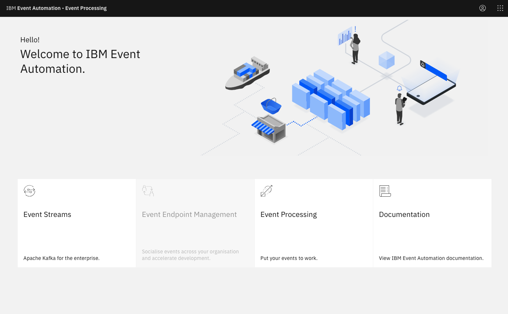
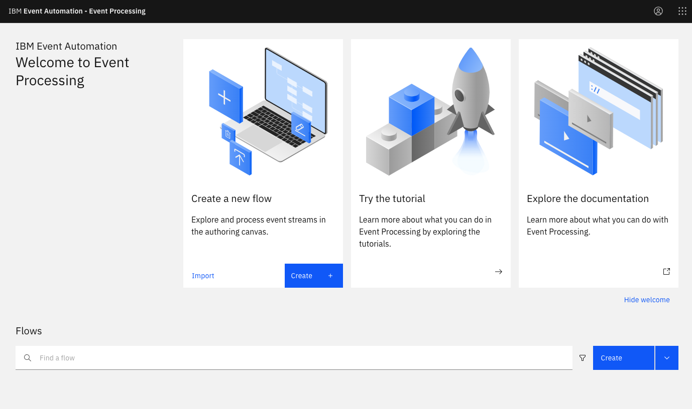
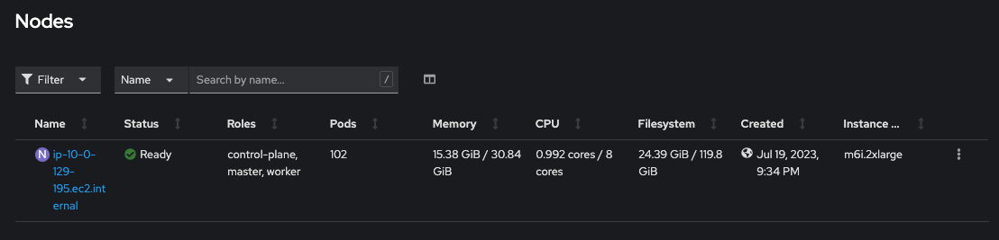

I've been lately exploring [Red Hat Single Node Openshift](https://www.redhat.com/en/blog/meet-single-node-openshift-our-smallest-openshift-footprint-edge-architectures). It is a deployment option announced by Red Hat in 2021, aiming to support applications that won't require extensive hardware footprints, for example, [edge computing](https://www.redhat.com/en/topics/edge-computing/what-is-edge-architecture).

> Edge computing refers to computing done at the location closest to a system’s data or its end user—where information is coming from or going to. Edge architecture allows processing to occur more quickly by reducing latency and lag. 

Merging the power of edge computing and [event processing](https://www.ibm.com/products/event-automation) can open up great momentum to optimize the current landscape of business activities. For instance:

1. **Predictive Maintenance**: pull and analyze data from distributed devices, and detect in changes supply-chains before failure occurs.
2. **Real-time Awareness**: gather insights from distributed devices and processes, optmize business visibility, and allow responding in real time.


In today blog, I'll explore the `Single Node OpenShift` along with `IBM Event Automation` installation.


## Steps

### Setup Single Node OpenShift:

The deployment requires at least the following:
* 8 vCPU cores
* 16GB of RAM
* 120GB Storage

You can refer to the official guide for the deployment: [Installing OpenShift on a single node
](https://docs.openshift.com/container-platform/4.13/installing/installing_sno/install-sno-installing-sno.html)

> In my case, I used AWS EC2 (m6i.2xlarge), EBS and EFS.


### Setup IBM Cert Manager

The installation steps are similar to the regular OpenShift deployment procedure.


* Add the catalog source:

```bash
cat << EOF | oc apply -f -
apiVersion: operators.coreos.com/v1alpha1
kind: CatalogSource
metadata:
   name: ibm-operator-catalog
   namespace: openshift-marketplace
spec:
   displayName: "IBM Operator Catalog"
   publisher: IBM
   sourceType: grpc
   image: icr.io/cpopen/ibm-operator-catalog
   updateStrategy:
     registryPoll:
       interval: 45m
  EOF    
```

* Install the `IBM Cert-Manager` from the OperatorHub.
* Install the `CertManagerConfig` CR:

```bash
cat << EOF | oc apply -f -
    apiVersion: operator.ibm.com/v1
    kind: CertManagerConfig
    metadata:
    labels:
        app.kubernetes.io/instance: ibm-cert-manager-operator
        app.kubernetes.io/managed-by: ibm-cert-manager-operator
        app.kubernetes.io/name: cert-manager
    name: default
    spec:
    license:
        accept: true
    certManagerController:
        resources:
        limits:
            cpu: 80m
            memory: 530Mi
        requests:
            cpu: 20m
            memory: 230Mi
    certManagerWebhook:
        resources:
        limits:
            cpu: 60m
            memory: 100Mi
        requests:
            cpu: 30m
            memory: 40Mi
    certManagerCAInjector:
        resources:
        limits:
            cpu: 100m
            memory: 520Mi
        requests:
            cpu: 20m
            memory: 410Mi
    enableCertRefresh: true
    enableWebhook: true
    version: 4.0.0
    imageRegistry: icr.io/cpopen/cpfs
    disableHostNetwork: true
EOF    
```

For more details refer to: [Installing IBM Cert Manager](https://www.ibm.com/docs/en/cloud-paks/foundational-services/4.0?topic=management-installing-cert-manager).


### Setup IBM Event Automation

The installation steps are similar to the regular OpenShift deployment procedure.


* Create a namespace

```bash
oc create new-project ep
```

* Install the `IBM Operator for Apache Flink` and `IBM Event Processing operator` from the OperatorHub.
* Create the `FlinkDeployment` and `EventProcessing` Custom Resources.

For more details refer to: [Installing Event Processing](https://ibm.github.io/event-automation/ep/installing/installing/).

> Note: if you wish to persist the data, consider LVM Operator, which provides block-based storage. You can use the Rook NFS operator to provision file-based on top of LVM. 


### _Bonus: Activate IBM Event Streams_

* The installation steps are similar to the regular OpenShift deployment procedure. Refer to the guide: [Installing Event Streams](https://ibm.github.io/event-automation/es/installing/installing/).

* Create the welcome-page configration, and update the value with the routes.

```yaml
kind: ConfigMap
apiVersion: v1
metadata:
    name: event-automation-welcome-urls
data:
    WELCOME_URL_EVENT_STREAMS: _welcome_url_eventstreams
    WELCOME_URL_EVENT_PROCESSING: _welcome_url_eventprocessing
```

* Update the `Event Processing` Custom Resource with the following block to mount the `ConfigMap`

```yaml
spec:
    template:
      pod:
        spec:
          containers:
            - envFrom:
                - configMapRef:
                    name: event-automation-welcome-urls
              name: ui
```

### Results

* IBM Event Automation welcome page. 


* Event Processing 



* Event Streams 


* OpenShift usage (idle state)
