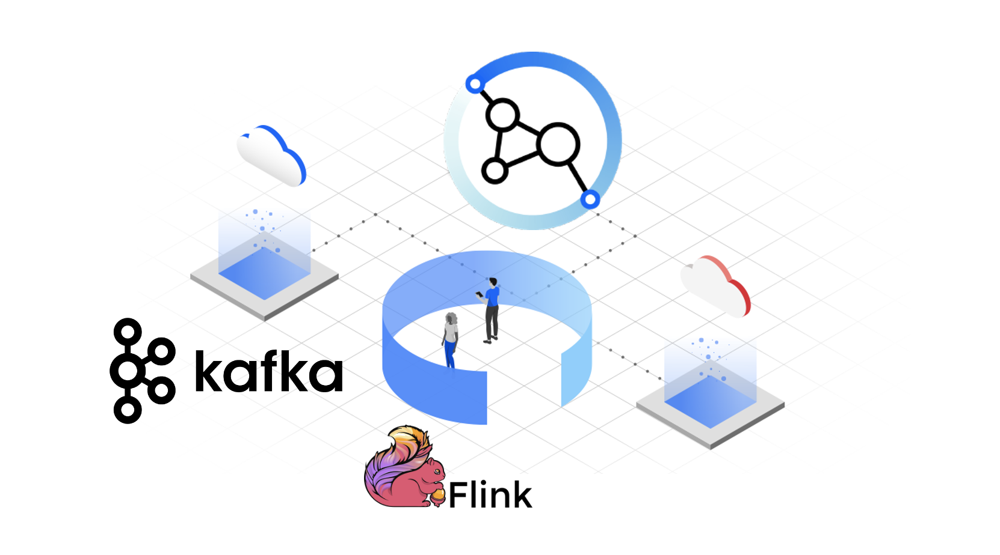
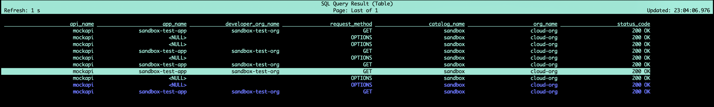

One of the API Connect features is to [source out](https://www.ibm.com/docs/en/api-connect/10.0.5.x_lts?topic=features-offloading-data-third-party-system) API events to a 3rd party system. In today's blog, I will offload the events to an [IBM Event Streams](https://www.ibm.com/docs/en/cloud-paks/cp-integration/2022.4?topic=capabilities-event-streams-deployment) and connect [Apache Flink SQL client](https://nightlies.apache.org/flink/flink-docs-master/docs/dev/table/sqlclient/) to analyze events in real time.

* First, add the external system configurations to `APIConnectCluster` CR.

```yaml
  analytics:
    external:
      offload:
        enabled: true
        output: |
          kafka {
                topic_id => "apic-analytics"
                bootstrap_servers => "hostname:port"
                codec => "json"
                id => "kafka_offload"
                ssl_truststore_location => "/etc/velox/external_certs/offload/truststore.p12"
                ssl_keystore_location => "/etc/velox/external_certs/offload/keystore.p12"
                ssl_truststore_type => "PKCS12"
                ssl_keystore_type => "PKCS12"
                security_protocol => "SSL"
          }
        secretName: offload-a7s-certificates
```

* Review the `a7s-ingestion` pod's logs, to ensure the connection is completed.

* I will use Apache Flink SQL client to analyze the incoming events.

> Download Apache Flink [sql-client.sh](https://github.com/apache/flink/blob/master/flink-table/flink-sql-client/bin/sql-client.sh). You can download the files from here: https://flink.apache.org/downloads.

* Obtain required dependencies: `flink-sql-connector-kafka-1.17.0.jar` and `kafka-clients-3.4.0.jar`. You can download them from the [maven repository](https://search.maven.org/).

* Run the SQL client and pass the required JAR files

```bash
flink-1.17.0/bin/sql-client.sh --jar flink-sql-connector-kafka-1.17.0.jar --jar kafka-clients-3.4.0.jar
```

* Flink SQL terminal will pop up, then you can start by creating the SQL table:

```sql
CREATE TEMPORARY TABLE sandboxEvents (
      api_name STRING,
      app_name STRING,
      developer_org_name STRING,
      request_method STRING,
      catalog_name STRING,
      org_name STRING,
      status_code STRING
  ) WITH (
    'connector' = 'kafka',
    'topic' = 'apic-analytics',
    'properties.group.id' = 'flink-consumer-group',
    'properties.bootstrap.servers' = '<bootstrap_route>:443',
    'format' = 'json',
    'scan.startup.mode' = 'earliest-offset',
    'json.ignore-parse-errors' = 'true',
    'properties.security.protocol' = 'SASL_SSL',
    'properties.ssl.truststore.location' = '<path>/es-cert.p12',
    'properties.ssl.truststore.password' = '*****',
    'properties.sasl.mechanism' = 'SCRAM-SHA-512',
    'properties.ssl.protocol' = 'TLSv1.2',
    'properties.sasl.jaas.config' = 'org.apache.kafka.common.security.scram.ScramLoginModule required username="*****" password="*****";'
  );
```

* Finally, you can display and analyze events using regular [SQL queries](https://www.geeksforgeeks.org/sql-concepts-and-queries/) like:

```sql
select * from sandboxEvents;
```

