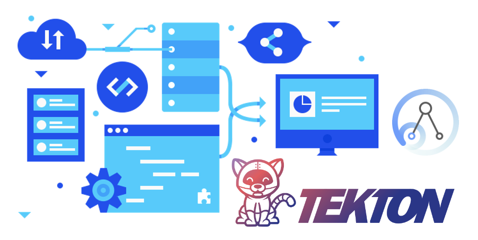

Over a coffee, a friend of mine asked me .. why enterprises should consider integration modernization? Indeed, it is a big question, and you can write a book to answer that. 
> An IBM Redbooks publication: [Accelerating Modernization with Agile Integration](http://www.redbooks.ibm.com/abstracts/sg248452.html?Open)

In my opinion, unifying development and operational practices are vital drivers; simultaneously, it significantly expedites business results. Automated pipelines can simplify various developmental and operational activities such as scanning, building, and deploying apps.

In today's blog, we will discuss a few steps that are required to start building your automated pipelines using [Tekton](https://tekton.dev).

## Create Service Account

```yaml
kind: ServiceAccount
apiVersion: v1
metadata:
  name: pipeline-bot
  namespace: openshift-pipelines
secrets:
  - name: basic-user-git
  - name: container-registry-secret
imagePullSecrets:
  - name: container-registry-secret
```

> Note that I've added the requried secrets to access `GitHub` and `Quay.io`.


## Define Tekton Tasks

* **Task**: Clone Git repo, build, and push a container image to Container Registry

```yaml
apiVersion: tekton.dev/v1beta1
kind: Task
metadata:
  name: build-push-is-new-orders
  namespace: openshift-pipelines
spec:
  params:
    - default: registry.redhat.io/rhel8/buildah
      description: The location of the buildah builder image.
      name: BUILDER_IMAGE
      type: string
    - default: ./Dockerfile
      description: Path to the Dockerfile to build.
      name: DOCKERFILE
      type: string
    - default: 'false'
      description: Verify the TLS on the registry endpoint
      name: TLSVERIFY
      type: string
  resources:
    inputs:
      - name: source
        type: git
      - name: image
        type: image
  steps:
    - image: $(params.BUILDER_IMAGE)
      name: build
      resources: {}
      script: |
        . ./release
        buildah bud --storage-driver=vfs --format=oci \
          --tls-verify=$(params.TLSVERIFY) --layers \
          -f $(params.DOCKERFILE) -t $(resources.inputs.image.url) .
      securityContext:
        privileged: true
      volumeMounts:
        - mountPath: /var/lib/containers
          name: varlibcontainers
      workingDir: /workspace/source
    - image: $(params.BUILDER_IMAGE)
      name: push
      resources: {}
      script: |
        . ./release
        buildah push --storage-driver=vfs --tls-verify=$(params.TLSVERIFY) \
          $(resources.inputs.image.url) \
          'docker://$(resources.inputs.image.url)'
      securityContext:
        privileged: true
      volumeMounts:
        - mountPath: /var/lib/containers
          name: varlibcontainers
      workingDir: /workspace/source
  volumes:
    - emptyDir: {}
      name: varlibcontainers
```

* **Task**: Create an `IntegrationServer` instance

```yaml
apiVersion: tekton.dev/v1beta1
kind: Task
metadata:
  name: deploy-is-new-orders
  namespace: openshift-pipelines
spec:
  resources:
    inputs:
      - name: image
        type: image
  steps:
    - image: 'quay.io/openshift/origin-cli:latest'
      name: deploy
      resources: {}
      script: |
        cat << EOF | oc apply -f -
            apiVersion: appconnect.ibm.com/v1beta1
            kind: IntegrationServer
            metadata:
              name: new-order-app-demo-01
              namespace: cp4i
            spec:
              enableMetrics: true
              license:
                accept: true
                license: L-APEH-C79J9U
                use: CloudPakForIntegrationNonProduction
              pod:
                containers:
                  runtime:
                    image: $(resources.inputs.image.url)
                    imagePullPolicy: Always
                    resources:
                      limits:
                        cpu: 300m
                        memory: 350Mi
                      requests:
                        cpu: 300m
                        memory: 300Mi
              adminServerSecure: false
              router:
                timeout: 120s
              designerFlowsOperationMode: disabled
              createDashboardUsers: true
              service:
                endpointType: http
              replicas: 1
              version: 12.0.3.0-r1
        EOF
```


## Define Tekton Pipeline Resources

* **PipelineResource**: type git server

```yaml
apiVersion: tekton.dev/v1alpha1
kind: PipelineResource
metadata:
  name: git-is-new-orders
  namespace: openshift-pipelines
spec:
  params:
    - name: revision
      value: main
    - name: url
      value: 'https://github.com/RashidAljohani/New-Orders-Service.git'
  type: git
```

* **PipelineResource**: type container image

```yaml
apiVersion: tekton.dev/v1alpha1
kind: PipelineResource
metadata:
  name: image-is-new-orders
  namespace: openshift-pipelines
spec:
  params:
    - name: url
      value: 'quay.io/rashid_aljohani/is-new-orders:0.1'
  type: image
```

## Define Tekton Pipeline 

* **Pipeline**: describe the pipeline flow

```yaml
apiVersion: tekton.dev/v1beta1
kind: Pipeline
metadata:
  name: pl-is-new-orders
  namespace: openshift-pipelines
spec:
  resources:
    - name: git-is-new-orders
      type: git
    - name: image-is-new-orders
      type: image
  tasks:
    - name: build-push-is-new-orders
      resources:
        inputs:
          - name: source
            resource: git-is-new-orders
          - name: image
            resource: image-is-new-orders
      taskRef:
        kind: Task
        name: build-push-is-new-orders
    - name: deploy-is-new-orders
      resources:
        inputs:
          - name: image
            resource: image-is-new-orders
      runAfter:
        - build-push-is-new-orders
      taskRef:
        kind: Task
        name: deploy-is-new-orders
```


## Define Tekton PipelineRun

```yaml
apiVersion: tekton.dev/v1beta1
kind: PipelineRun
metadata:
  name: plr-is-new-orders
  namespace: openshift-pipelines
spec:
  pipelineRef:
    name: pl-is-new-orders
  resources:
    - name: git-is-new-orders
      resourceRef:
        name: git-is-new-orders
    - name: image-is-new-orders
      resourceRef:
        name: image-is-new-orders
  serviceAccountName: pipeline-bot
```


## Create custom SCC

As a best practice, use a custom SCC and a custom service account for pipeline runs and task runs. This approach allows greater flexibility and does not break the runs when the defaults are modified during an upgrade.

```yaml
apiVersion: security.openshift.io/v1
kind: SecurityContextConstraints
metadata:
  annotations:
    kubernetes.io/description: my-scc is a close replica of anyuid scc. pipelines-scc has fsGroup - RunAsAny.
  name: custom-scc-tekton
allowHostDirVolumePlugin: false
allowHostIPC: false
allowHostNetwork: false
allowHostPID: false
allowHostPorts: false
allowPrivilegeEscalation: true
allowPrivilegedContainer: false
allowedCapabilities: null
defaultAddCapabilities: null
fsGroup:
  type: RunAsAny
groups:
- system:cluster-admins
priority: 10
readOnlyRootFilesystem: false
requiredDropCapabilities:
- MKNOD
runAsUser:
  type: RunAsAny
seLinuxContext:
  type: MustRunAs
supplementalGroups:
  type: RunAsAny
volumes:
- configMap
- downwardAPI
- emptyDir
- persistentVolumeClaim
- projected
- secret
```

* Add the custom `SecurityContextConstraints` to the `ServiceAccount`

```bash
$ oc adm policy add-scc-to-user custom-scc-tekton -z pipeline-bot -n openshift-pipelines
```


> Referance [Using pods in a privileged security context](https://docs.openshift.com/container-platform/4.8/cicd/pipelines/using-pods-in-a-privileged-security-context.html)