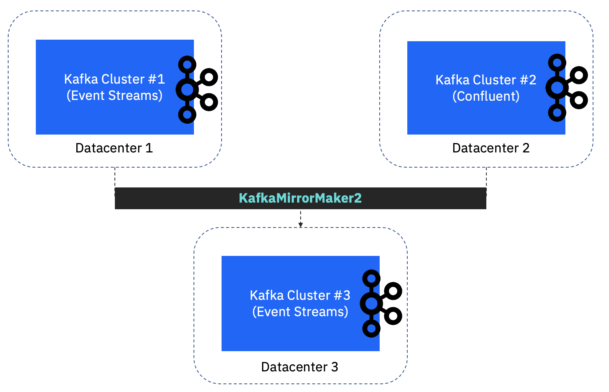
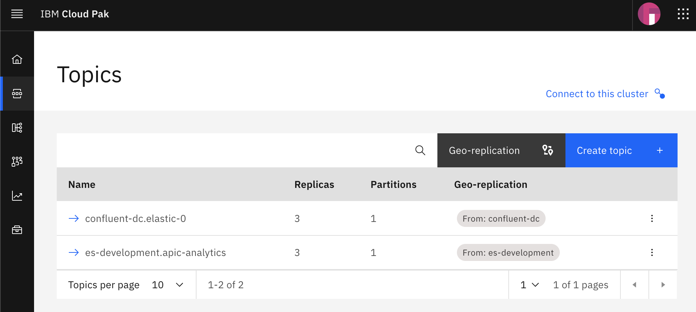

You might end up using several Apache Kafka vendors/clusters to serve various projects in your organization, and now you plan to centralize some topics in a Kafka Cluster; such as a disaster recovery use-cases.

[MirrorMaker](https://strimzi.io/blog/2020/03/30/introducing-mirrormaker2/) is a multi-cluster data replication engine based on the Kafka Connect framework.


In the following steps, you will learn how to replicate 2 distinct topics running in 2 different clusters to a centralized cluster. I will use two Apache Kafka vendors; [IBM Events Streams](https://www.ibm.com/cloud/event-streams) (clusters 1 & 3) and [Confluent Platform](https://developer.confluent.io/) (cluster 2). 


* First, define [Geo-Replicator](https://ibm.github.io/event-streams/georeplication/about/) instance using `EventStreamsGeoReplicator` custom resource definition. This should match the desintation cluster (centralized cluster).

```yaml
apiVersion: eventstreams.ibm.com/v1beta1
kind: EventStreamsGeoReplicator
metadata:
  name: kafka-centralized
  labels:
    eventstreams.ibm.com/cluster: kafka-centralized
spec:
  replicas: 1
  version: latest
```

> Make sure you set the `eventstreams.ibm.com/cluster` property value to the name of your destination IBM Event Streams instance.

* Once the instance is `Ready`, you will find a `KafkaMirrorMaker2` instance automatically created within the same namespace. Now, we can define the source Kafka clusters.

* There are two important keys in the `KafkaMirrorMaker2` definition: `spec.clusters` and `spec.mirrors`. You can refer to the [schema](https://strimzi.io/docs/operators/in-development/configuring.html#type-KafkaMirrorMaker2Spec-reference) for more details.

* Add the following block to define [PLAINTEXT connection](https://kafka.apache.org/33/documentation.html#producerconfigs_security.protocol)

```yaml
spec:
  clusters:
    - alias: kafka-dc-1
      bootstrapServers: '<bootstrapServers>:9092'
```

* Then, define the mirroring configurations for each Kafka source clusters

```yaml
spec:
  mirrors:
    - sourceCluster: kafka-dc-1
      checkpointConnector:
        config:
          checkpoints.topic.replication.factor: 1
        tasksMax: 5
      sourceConnector:
        config:
          consumer.group.id: __eventstreams_georeplicator_kafka-dc-1_kafka-centralized
          offset-syncs.topic.replication.factor: 1
          replication.factor: 3
          sync.topic.acls.enabled: 'false'
        tasksMax: 5
      targetCluster: kafka-centralized-mm2connector
      topicsPattern: <source-topic>
```

and that's about it! Here's a screenshot of the implementation:





> Bonus, you might want to secure the data replication over TLS or SASL_SSL connection. 

* You can add the following keys in the `spec.clusters` configurations:

```yaml
      authentication:
        certificateAndKey:
          certificate: user.crt
          key: user.key
          secretName: <mycerts-secret>
        type: tls
      bootstrapServers: '<bootstrapServers>:443'
      tls:
        trustedCertificates:
          - certificate: server.crt
            secretName: <mytruststore-secret>
```