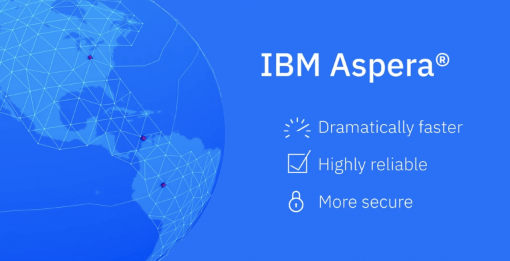
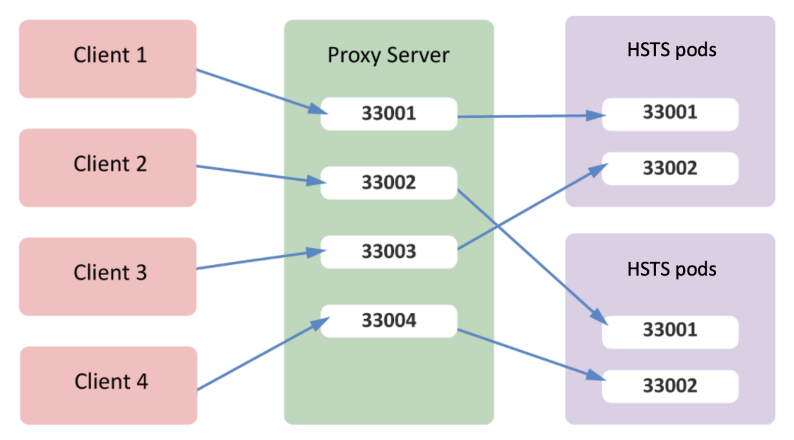

I was asked to work on an MVP involving multiple cloud environments; private cloud on-prem, AWS, and Azure. I've come across a situation where one cluster was missing load balancing capabilities.


Aspera HSTS, by design, requires a load balancing feature that exposes multiple UDP ports on the reverse proxy. Ports are opened based on the value specified by `<proxy_port>.` 



> 33001 is the default if not specified.

One of the solutions, you could have spin-off the Aspera Proxy, and turn on the balancing feature in the proxy server's `aspera.conf`, set `<balancing>`

```xml
<rule host_ip="10.20.101.151">
    <balancing>round_robin</balancing>
    <hosts>
        <host>10.20.103.133:33001</host>
        <host>10.20.103.134:33001</host>
        <host>10.20.103.135:33001</host>
    </hosts>
    <keyfile>/home/$(user)/.ssh/id_rsa</keyfile>
</rule>
```


We were interested in looking into a solution that can be hosted within the containerization environments to make an Aspera HSTS accessible through external clients. 

I've came across [Metallb](https://metallb.universe.tf/); 

> MetalLB hooks into your Kubernetes cluster, and provides a network load-balancer implementation. In short, it allows you to create Kubernetes services of type LoadBalancer.

First, let's understand some of the MetalLB CRD concepts:

1. **MetalLB**: is the Schema for the metallbs API
2. **AddressPool**: is a list of IP address ranges over which `MetalLB` has authority.


## Steps

* Creat Aspera HSTS CR

```yaml
apiVersion: hsts.aspera.ibm.com/v1
kind: IbmAsperaHsts
metadata:
  name: aspera-hsts
  labels:
    app.kubernetes.io/instance: ibm-aspera-hsts
    app.kubernetes.io/managed-by: ibm-aspera-hsts
    app.kubernetes.io/name: ibm-aspera-hsts
spec:
  license:
    accept: false
    key: ''
    use: CloudPakForIntegrationNonProduction
  deployments:
    default:
      replicas: 1
  version: 4.0.0
  storages:
    - claimName: aspera-file-gold-pvc
      class: ibmc-file-gold-gid
      deleteClaim: true
      mountPath: /data/
      size: 20Gi
  redis:
    persistence:
      enabled: false
  services:
    httpProxy:
      type: ClusterIP
    tcpProxy:
      type: LoadBalancer
```

* Install Operator Lifecycle Manager (OLM), in case you do not have it in your cluster

```bash
$ curl -sL https://github.com/operator-framework/operator-lifecycle-manager/releases/download/v0.20.0/install.sh | bash -s v0.20.0
```

* Install the MetalLB operator

```bash
$ kubectl create -f https://operatorhub.io/install/metallb-operator.yaml
```

* Validate the csv status

```bash
$ kubectl get csv -n my-metallb-operator
```

* Deply Metallb CR

```yaml
apiVersion: metallb.io/v1beta1
kind: MetalLB
metadata:
  name: metallb
  namespace: metallb-system
```


* Create an address pool

```yaml
apiVersion: metallb.io/v1alpha1
kind: AddressPool
metadata:
  name: addresspool-sample1
  namespace: metallb-system
spec:
  name: default
  protocol: layer2
  addresses:
    - 172.18.0.100-172.18.0.255
```


In a few moments, you should find your `aspera-tcp-proxy` has been assigned to the Loadbanancer external IP address.