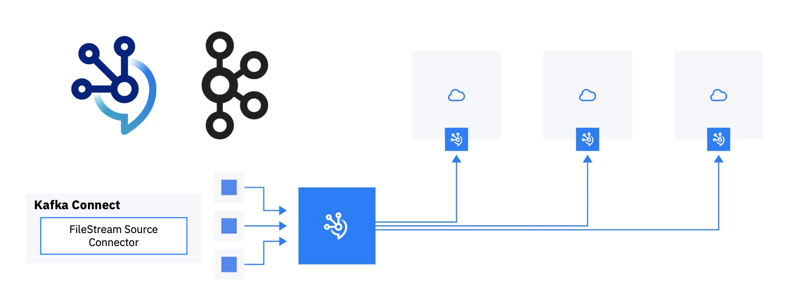

I came across recently to use-case where a customer wanted to stream metadata from a file to a Kafka topic. I found it an interesting problem because of the typical behavior of cloud-native applications with respect to states or applications with volumes - specific questions like: where will those files be stored? Dynamic options to update the files and mount them to the source components.

The following steps will solve that by using [KafkaConnect](https://docs.confluent.io/platform/current/connect/index.html) and [KafkaConnectors ](https://ibm.github.io/event-streams/connecting/connectors/)


* Create a configMap which the data you want to source to Kafka Topic

```bash
cat <<EOF | kubectl apply -f -
  apiVersion: v1
  kind: ConfigMap
  data:
    configuration.json: |
      {"maxThreadCount":"10", "type":"GITHUB"},  
      {"maxThreadCount":"30", "type":"JSON"}  
  metadata:
    name: metadata-configuration
EOF
```

* Download KafkaConnector libraries and dependencies, in my case it was [Apache Kafka File Connect](https://mvnrepository.com/artifact/org.apache.kafka/connect-file)

* Create custom KafkaConnect image

```dockerfile
FROM cp.icr.io/cp/ibm-eventstreams-kafka:10.5.0
COPY ./my-plugins/ /opt/kafka/plugins/
USER 1001
```

> Place the KafkaConnector libraries and dependencies inside `my-plugins` folder.

* Build, Tag, Push the container image

```bash
$ docker build -t my-connect-cluster:1.0 .
$ docker tag my-connect-cluster:1.0 quay.io/rashid_aljohani/my-connect-cluster:1.0
$ docker push quay.io/rashid_aljohani/my-connect-cluster:1.0
```

* Create KafkaConnect enviroment with the custome image

```yaml
apiVersion: eventstreams.ibm.com/v1beta2
kind: KafkaConnect
metadata:
  name: my-connect-cluster
  annotations:
    eventstreams.ibm.com/use-connector-resources: "true"
spec:
  version: 2.8.1
  replicas: 1
  bootstrapServers: es-lite-kafka-bootstrap.cp4i.svc:9092
  image: quay.io/rashid_aljohani/my-connect-cluster:1.0
  template:
    pod:
      imagePullSecrets: []
      metadata:
        annotations:
          eventstreams.production.type: CloudPakForIntegrationNonProduction
          productID: 2a79e49111f44ec3acd89608e56138f5
          productName: IBM Event Streams for Non Production
          productVersion: 11.0.3
          productMetric: VIRTUAL_PROCESSOR_CORE
          productChargedContainers: my-connect-cluster-connect
          cloudpakId: c8b82d189e7545f0892db9ef2731b90d
          cloudpakName: IBM Cloud Pak for Integration
          cloudpakVersion: 2022.2.1
          productCloudpakRatio: "2:1"
  config:
    group.id: connect-cluster
    offset.storage.topic: connect-cluster-offsets
    config.storage.topic: connect-cluster-configs
    status.storage.topic: connect-cluster-status
    config.storage.replication.factor: 1
    offset.storage.replication.factor: 1
    status.storage.replication.factor: 1
  externalConfiguration:
    volumes:
      - name: metadata-configuration
        configMap:
          name: metadata-configuration
```

> The intance is using the custom image via `spec.image`

> The intance enables the use of KafkaConnectors via `metadata.annotations.eventstreams.ibm.com/use-connector-resources: "true"`

> The ConfigMap is mounted via `spec.externalConfiguration`, files will store at `/opt/kafka/external-configuration/`


* Create Kafka Connector intance, `FileStream` in this case, and update the configration to match your target system - such as topic name and filename

```bash
cat <<EOF | kubectl apply -f -
  apiVersion: eventstreams.ibm.com/v1beta2 
  kind: KafkaConnector 
  metadata: 
    name: filestream-source-connector 
    labels: 
      eventstreams.ibm.com/cluster: my-connect-cluster 
  spec: 
    class: FileStreamSourceConnector
    tasksMax: 1
    config:
      file: "/opt/kafka/external-configuration/<configmap-name>"
      topic: <topic-name>
EOF
```